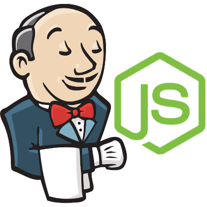
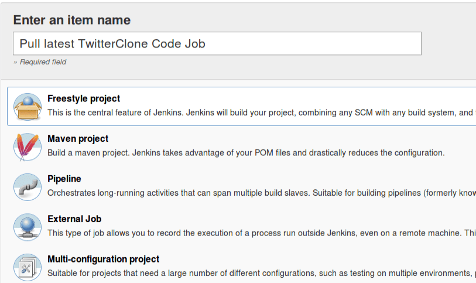
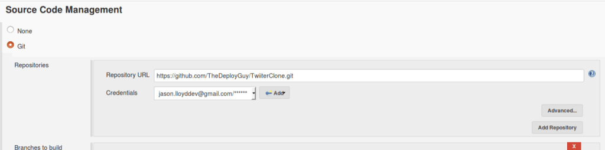
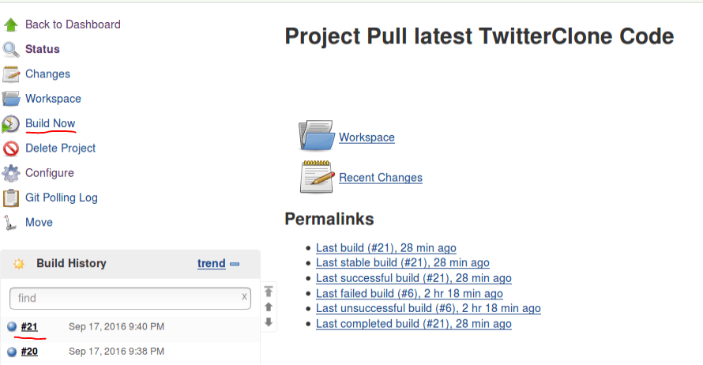
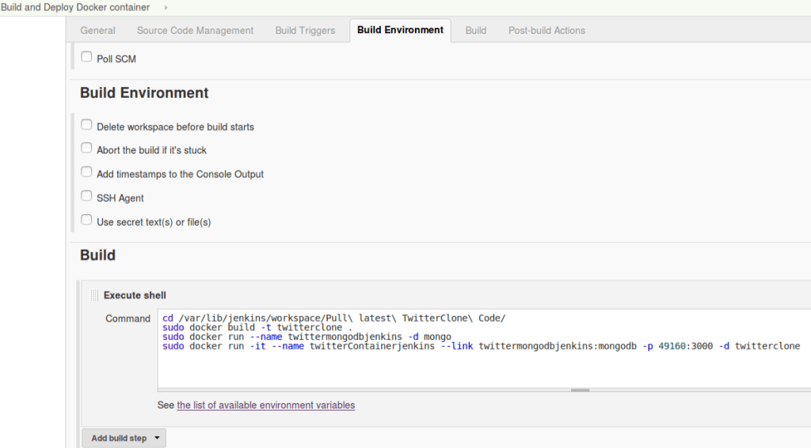
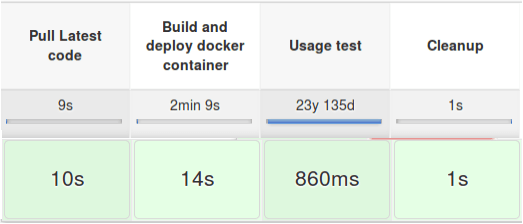

Welcome back, this week we are going to look at Jenkins.

Jenkins is a "continuous integration" tool that can help a team or organisation continuously test and integrate their code via pipelines, plugins and various other features. Jenkins is a tool I use every day in my job, we have pipelines that we use to deploy and test various environments. I am going to try to integrate it into an existing project TwitterClone.

Today's tutorial we are going to create a pipeline to deploy and test our TwitterClone application which involves:

- Pulling the latest code from git
- Using Docker to deploy our application to a container
- Perform some small tests to make sure our container is up on the right port and looks good
- Cleaning up Docker containers so we can rerun our same pipeline

First things first let us setup Jenkins since I am using Ubuntu I went to the following link: [http://pkg.jenkins-ci.org/debian-stable/](http://pkg.jenkins-ci.org/debian-stable/) Note: there is a docker image available in which you could to setup Jenkins in docker it but I wanted to keep this tutorial simple by installing it locally. In another tutorial, we will move to have Jenkins running on a docker image.

After you have Jenkins setup navigate to localhost:8080 and you will go through the setup process using the default options should get you through. Once you get through the start-up process you will be directed to the Jenkins home page. For our project we are going to have the following:

- Pull latest TwitterClone Code Job - which as the name says will pull the code from Git
- Build and Deploy Docker container Job - which will build our docker image and deploy it to a container
- TwitterClone Pipeline Job which will link all our jobs together in a nice view, we will also do some small testing to make sure the app is up and then clean up our docker containers so the pipeline can rerun.

Creating the TwitterClone Code Job:

Once you have the following selected click ok which will then bring you to a config screen. This is where you define what your job is going to do for us we are only going to need to do this:

We are pointing it at our git repo and I have added the creds for my git account. You will need to click the add button beside the Credentials field and add your git username and password, once you have that setup just click save. After we have saved the job lets kick it off and give it a test by clicking the "Build Now" button on the right.

After the build is done you will see how it went in the Build History view if it's blue it means it was successful, if it's red it failed, you can click the build history to see the output.

Now we have a job that pulls our code from Git next we will create a job to build a docker image and deploy it to a container. First, let's add a Dockerfile to our TwitterClone project:

// Insert docker fil

This is a very boilerplate Dockerfile that we have used in previous projects, its a template for deploying NodeJS applications to docker images.

Now that we have that setup lets create a job that actually uses it. So like before on the Jenkins homepage -> new item -> Freestyle Project this time we are going to run shell commands to build a docker image and deploy it to a container here is how it is done:  So what are we doing here? Well we are executing a shell command that:

1. 1. Navigates to where our project will be pulled by the first job "Pull latest TwitterClone Code"
   2. Build a docker image called twitter clone using our Dockerfile as a blueprint
   3. Run a mongo container called twittermongodbjenkins that will serve as a mongo DB container
   4. Run a container called "twitterContainerjenkins" that is our  TwitterClone image that links to our MongoDB container and exposes port 49160. This port maps to the NodeJS application port so we can reach it outside of the container.

That is all we need for this job...I wouldn't recommend running this just yet simply because if it breaks somewhere in the middle you are going to need to clean it up which is a hassle. We will deal with cleaning it up later.

Next step is to create our pipeline job so: New item -> Pipeline give it a name I picked "TwitterClone Pipeline". Pipelines in Jenkins are useful we can use it to link a bunch of jobs or activities together and let them run one after each other.  In the UI you can link all the jobs we just created.

Let's explain each stage:

1. "Pull Latest" stage builds our Pull latest TwitterClone job.
2. "Build and deploy Docker container" stage builds our Build and Deploy Docker container job and also take a quick sleep ( as sometimes the web app is not up to quick enough for next step)
3. "Usage test stage" could be expanded on but it just makes sure our web app is up on the correct port via a curl command/
4. "Cleanup" stage once all the above passes we know we have deployed our application and everything deployed well so we clean up all the containers we created so we can start our pipeline again.

That is all our pipeline needs to do. Let's save it and give it a try:

We now have our working pipeline, which pulls our latest code, builds a docker image, deploys it to a container then runs some tests and finally does cleanup. Thanks for going through this with me catch you next week!

Jason
