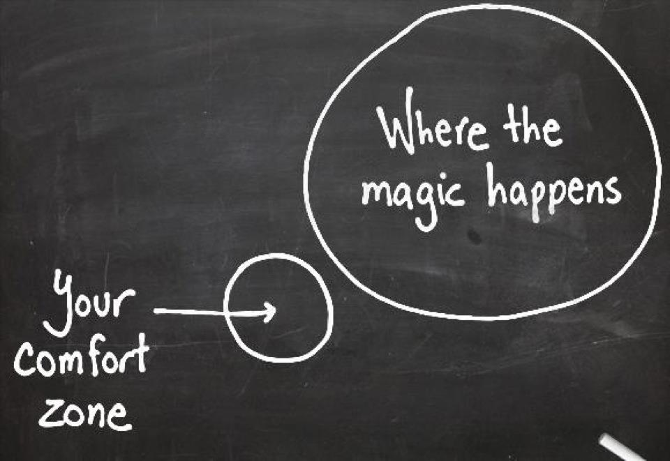

### Introduction

Welcome back guys, the last few posts has focused on more the technical side but this week will be a bit more personal. I will be discussing the Comfort Zone. So what is the "comfort zone"? I am pretty sure everyone is familiar with the concept of a comfort zone but this image sums it well:

> A **comfort zone** is a [psychological state](https://en.wikipedia.org/wiki/Mental_status_examination "Mental status examination") in which things feel familiar to a person and they are at ease and in control of their environment, experiencing low levels of [anxiety](https://en.wikipedia.org/wiki/Anxiety "Anxiety") and [stress](<https://en.wikipedia.org/wiki/Stress_(psychological)> "Stress (psychological)"). In this zone, a steady level of performance is possible - Wikipedia

While most people know the concept of a comfort zone, sometimes it is very difficult to identify what is inside and outside your comfort zone. There are obvious signs for certain comfort zones but for others, it's very hard. For example, it might be very easy to know places where you feel comfortable or people you are comfortable with but it's harder to identify your comfort zone in other areas such as your learning. This is the area I want to focus on in this post.

### My learning comfort zone

One area where I find myself constantly battling my comfort zone is with programming languages. Once you get used to programming in a certain way with a particular programming language it's very hard to break out of it. An example of this for me would be my relationship with the language Python.

At the start, I didn't take any courses on Python, I just pick up the language as I went along. I slowly created more and more complicated projects with python but I was always programming using the same techniques. I never heard of the concept of PEP, generators or decorators, I was:

> Programming **with** the language and not **in** the language - _Random person online_

In other words, I wasn't using the tools and features the language provided instead I was using it as if it was another programming language. \[I plan to write a bigger post on this subject\]

This finally changed when I was at an interview and I was asked to write a generator and I hadn't got a clue. In fairness to the interviewer, he explained exactly what it was and I got it. After that interview, I went on a Python tutorial binge and realised I was only using <20% of the language.

This was the situation that caused me to look at my learning and realised just how comfortable I was with certain tools and frameworks.

### Why going outside your comfort zone is a good thing?

So we discussed the comfort zone and I gave you an example of my own realisation of my comfort zone, why do we need to get out of our comfort zones?

- You learn new things
- You realise your weakness and how to improve them
- By breaking your comfort zone you might encourage others to do the same.
- The more you do it, the easier it gets and the more you learn about yourself

### Tips and Tricks for getting out of your comfort zone

We know the benefits and why we should go outside our comfort zone but how do we do it? Here are some tips I found very useful for breaking out of your comfort zone both in personal terms and programming:

- As soon as your brain is telling you reasons to not do something or you start feeling nervous don't think about it, just do it. This might seem crazy at first but if you learn to recognise the signs that your brain is trying to talk you out of it and you interrupt your thinking by taking action, your mind won't have time to talk you out of it. \***Note: Don't use this to do something illegal**\*
- Track daily how many times you broke your comfort zone. This might seem pointless but you realise how much of our lives are spent in our comfort zone.
- Read the docs for programming languages and look for more advanced tutorials on your chosen programming language.
- If the programming language you are using has a standard, read and it and code to it. The only exception to this is if your team has a very specific way they code then stick to that.

### Conclusion

Comfort zones are weird things...if you are aware of your comfort zones and how to break them, when you break them they can be life-changing. Anyway, I hope you enjoyed this post. If you recently felt like you broke your comfort zone then leave a comment and tell me about it!

Until next time,

Jason!
