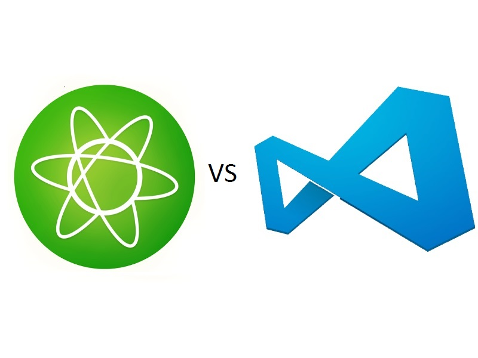
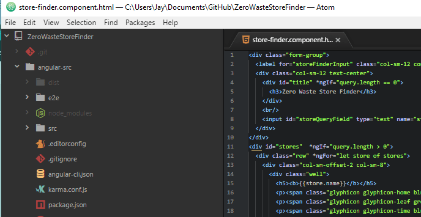
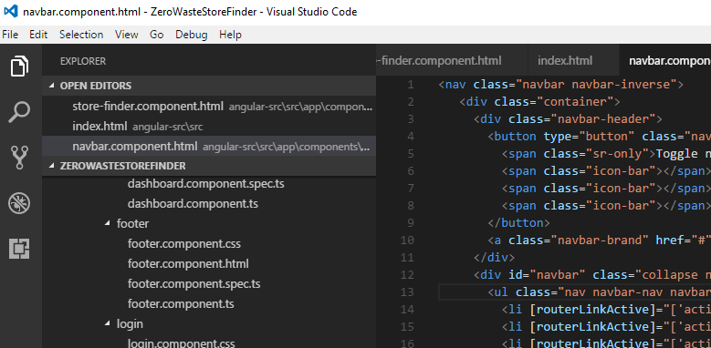

A few weeks ago I published a post for [My favourite Atom packages of 2017](http://thedeployguy.com/useful-atom-packages-2017/), a few weeks after this Atom started crashing and becoming slow. After looking around online it seems to be an issue with Atom and big projects. I went looking for an alternative editor and I saw a number of developers recommending Visual Studio Code (Not to be confused with the paid Visual Studio Suite.) I taught it would be good to briefly compare Visual studio Code to Atom and give my personal favourite.

### Comparing Atom vs Visual Studio Code

Let's compare both of them: Atom:

- Developed by the team at GitHub and is open sourced
- Has Git integration
- Completely hackable and customizable
- Huge library of packages to make atom do anything
- Very big active community
- Considered a text editor

Visual Studio Code

- Developed by Mircosoft and is open sourced
- Has Git integration
- Has built in Terminal, Debugger
- Supports extensions and has a rapidly growing library
- Considered an IDE

Atom

VSC:

The editors have pretty similar looks. The menu system in VSC is at the side while in Atom it is usually along the bottom. VSC is considered an IDE whereas Atom is an editor.

Atom is an older editor than VSC, developers of VSC have had time to see the mistakes that Atom made and improve on them. They were able to add features were Atom fell short.  However, Atom is still being actively developed and the team behind it has big plans for its future.

### My personal favourite

I have been using Atom exclusively for months now and until it started giving me trouble I would still be using it. However, the more I use Visual Studio Code the more I prefer it and here is why:

- VSC comes already with an integrated terminal, while I discussed a package to do this in Atom it's easier to have it already built-in.
- While at the start I hated the look of VSC I am really starting to like it. It's very minimal whereas Atom can become cluttered and the more packages you add to Atom the more cluttered it gets.
- VSC Code has an integrated debugger that can be extremely useful.

### Conclusion

Some will say it's not fair to compare an IDE to an Editor, while that is somewhat true they should be compared by how useful they are to developers. In my opinion,  VSC seems to do it better for me but that will not be the case for everybody. I suggest trying them both out and figure out which one you prefer. I hope you enjoyed this post, please let me know what your favourite editor is and why!

Jason
