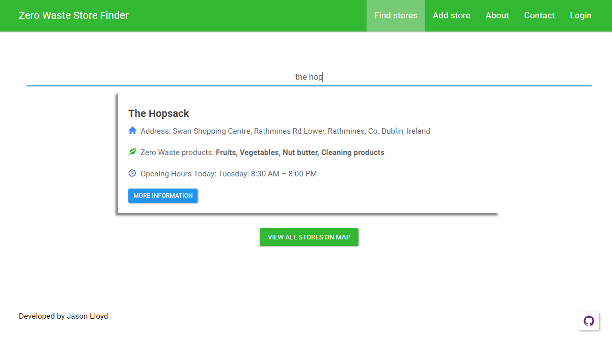

Welcome back guys, this week I wanted to talk about the project I have been working on since the end of February and just released [www.zerowasteshops.com](https://www.zerowasteshops.com/). I am excited to finally release it for use and feedback. I taught it would be interesting to give a background to the project and why I decided to build it.

## Project background

As with all projects lets start with the why. Why did I decide to create a website to find zero waste stores?. Recently my girlfriend got into the Zero Waste movement which is you try to reduce the amount of waste you produce e.g. bring your own bags shopping, buying loose fruits and veggies instead of ones wrapped in plastic and recycling. It's quite a bit more in-depth that my one-liner, if you're more interested there are some useful links on the site.

Anyway, she was having trouble finding stores that sell zero waste products, it seemed like you had to be lucky to find them. She joined facebook groups for Ireland where people post about zero waste topics. The majority of the posts are about places where they find stores that sell zero waste products. Seeing that she and everybody on these groups were having trouble, we taught we could develop a website to find stores easier. The idea behind the website is that it would be mostly community based if they found a store they could easily add it to the website and it could be easily found by other users. While the facebook group is great for putting up places that you find it's hard for new people to the group to scroll back and find stores whereas the website will be just a store search engine.

## Technology stack

When thinking about what technologies I wanted to use, I know I wanted to use the MEAN stack as I had some experience with it. However, I wanted to use Angular 2 and since I already used Angular 1 in several projects I didn't think it would be that difficult. Shortly after I started I realise how much of a change Angular 2 was compared to Angular 1. I watched a few videos and read a few blog posts on the subject which was enough to get started. Here is the list of the technologies I decided to go with:

- Front-end:
  - Angular 2
  - HTML
  - JavaScript
  - Bootstrap for CSS
- Back-end
  - NodeJS
  - Express
  - MongoDB

## Project Features

Now that the technology stack is picked next task was to come with the Features list i.e. the user stories. I wrote out a bunch of user stories like so: As a \[user/admin\] I want to be able to \[action\] - This is the standard user stories/user template for agile projects. It helps you identify a core set of features for different actors.

Here was the list I came up with in the end: User: As a user, I want to be able to search for stores As a user, I want to be able to add new stores As a user, I want to be able to see all zero waste shops on a map As a user, I want to be able to verify the place sells zero waste stuff As a user, I want to be able to contact the admin of website As a user, I want to see useful links and information about zero waste As a user, I want to be able to donate to support the website.

Admin: As an admin, I want to be able to add new stores As an admin, I want to be able to edit stores As an admin, I want to be able to delete stores As an admin, I want to able to see the user messages in dashboard

With the set of features in hand and the architecture decided it was time to get started.

## Project Conclusion

A little over 2 months later I finished developing the last feature based on the user stories. After finishing the last feature and verifying the project was working, the time came around to actually deploy it and make it available to the internet. I decided to go with Digital Ocean for hosting. It was my first time using digital ocean and I will give my thoughts on Digital Ocean in another post but some trouble later I got my very own VPS sorted and deployed the application to it. A bit of tinkering later and after following [this tutorial](https://www.youtube.com/watch?v=BUasdmczmMw) by [Traversy Media](https://www.youtube.com/channel/UC29ju8bIPH5as8OGnQzwJyA), I finally got it up and running at [www.zerowasteshops.com](https://www.zerowasteshops.com/).

## Future Plans

My future plans for the project is highly dependent on how the community takes to it. I am completely open to the community suggestions and feature requests for it. In the end, they are the target audience for the website and they would be the best people to ask. The plan is to post in the Facebook groups about the website and ask for feedback by the end of this week. I want to have a few shops added before they come so they can see what it is going to be like and to get the point of the website. I will post again in a few months with lessons learned and how the project went so stay tuned.

I hope you enjoyed this post, it's a bit of different post and I am very excited for the release of the project.  I am aware that the project might fail but I have positioned it such that even if it fails I still have learned so much from building it and release it that I can take into my next venture. If you guys end up visiting the site or better using it then please tell me what you taught!.

Jason
