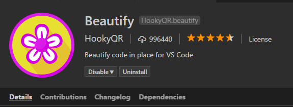
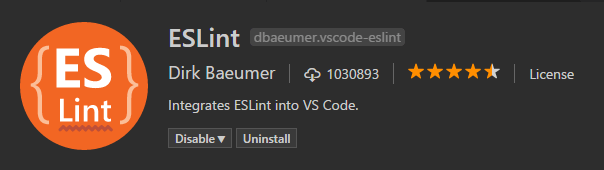
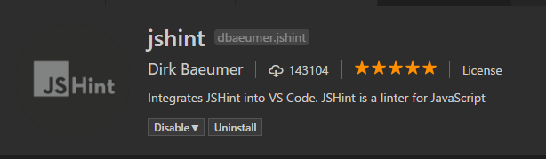
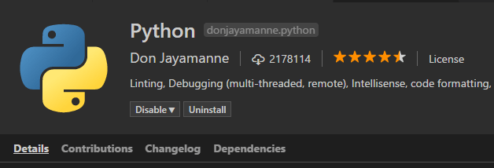
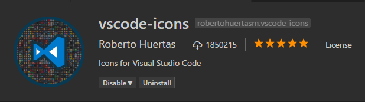
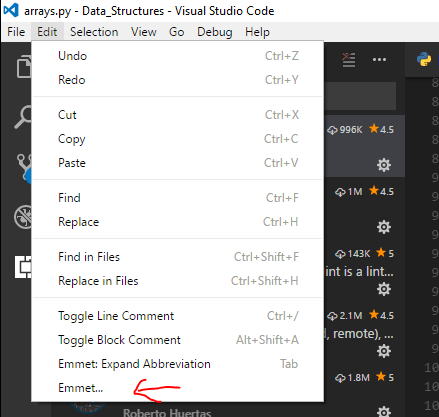

Welcome back guys, I wrote about recently about [Atom vs Visual Studio Code](http://thedeployguy.com/atom-vs-visual-studio-code/) and at the end of that post I said that I switched to VSC because of all it gives you in the box. This week I wanted to discuss my favorite extensions for it. I hope you find them useful. (If you want to see my favorite Atom extensions see [here](http://thedeployguy.com/useful-atom-packages-2017/))

## Extensions

### **Beautify**

 Beautify is an awesome extension for quickly formatting your code. It has support for most languages and I love its easy of use. Once you install it and you want to Beautify a file just press F1 to bring up the command menu type beautify and it will show "Beautify file".

### Linter's

 

I love Linter's, they provide an easy way for to see syntax errors in your files. It also helps you code to best practices for the languages. These are both javascript Linter's, one for ES6 and one for regular Javascript.

### Python

I work a lot in Python and this is by the far the best Python extension for VSC. It has Linting, Debugging, Intellisense, PEP 8 suggestions, Code Formatting and much more. If you work in python use this package.

### Visual Studio Icons

I taught Atom default icons were bad, well VSC has no concept of icons. This is where this extension comes in. They have icons for every language you can think of.

### Emmet

Once of my favorite extensions from Atom was Emmet. I couldn't understand why there was no version for VSC then I found out...it's built in. It's found here:

If you don't know emmet you should fix that. It's an awesome text expander for HTML. Let's say you need a Bootstrap row with two 6 column divs inside it. Instead of typing all that code manually you can just type: .row>.col-md-6\*2 and press tab and it will expand out fully. It is an awesome extension Bonus here is a [cheatsheet](https://docs.emmet.io/cheat-sheet/)

## Conclusion

I hope after reading this post you found at least 1 useful extension. I am sure that I am missing some great extensions, I would love to know your favorite extensions for Visual Studio Code.

Jason
