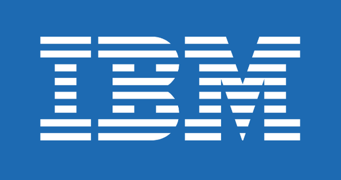

Welcome back guys, this week I taught I would write a bit more of a personal post. Over the past few weeks, I have been doing interviews and getting ready to switch Teams / Companies because of some recent changes. I won't get into too much detail on what happened but just a typical end of life cycle for projects. Anyway, after doing a few interviews I am officially changing teams within IBM.

As many of you may know, for the past 3.5 years I have been working on SmartCloud DevOps Team. When I first started, I was thrown into the deep-end with working mainly on Operations for Smartcloud. Not long after starting I was given my first Automation/Development task. I still remember exactly what I was asked to do, create an automation script to deploy a "single sided" environment. We already had a script that worked for "Two-sided" environments but it didn't work for "one-sided" because of various issues I won't go into. Most of our automation was/is written in Python so this script would have had to be developed in Python. Coming into this role I had no experience with Python so the script took me a bit longer as I was also learning the language. After 1 or 2 weeks and testing the code, I checked it in and my code was ready for use. That started a long line of Automation tasks around making our deployments more hands off and trying to automate as much of our manual tasks as possible.

3 years and many many projects later mostly around Deployment Automation, I switched to helping our Security Team automate a lot of their manual tasks. There was a huge amount of work to do and deadlines for everything. Since there was little automation around Security, there was a lot of freedom around the technologies I wanted to use. While my time in the security team was shorter than I expected it was a good experience and I learned a lot, specifically around how servers become vulnerable to attacks/hacks.

There is a very condensed summary of my 3+ years so far at IBM. I have worked with a lot of amazing people on the team and I appreciated every moment of it. Now it is time for me to move teams and onto what should be a very exciting project. I will be joining the Innovation Exchange Team as a Senior Software Engineer, the team mainly focuses around [H2020 projects](http://www.horizon2020.ie/). I am very excited about what the future holds and I am excited to be working on something brand new!

I hope you guys enjoyed this post, I usually like talking about random technologies but it is also sort of a personal journal for me. Let me know if you guys have had experiences with switching teams or roles lately would love to hear how it went.

Thanks

Jason
