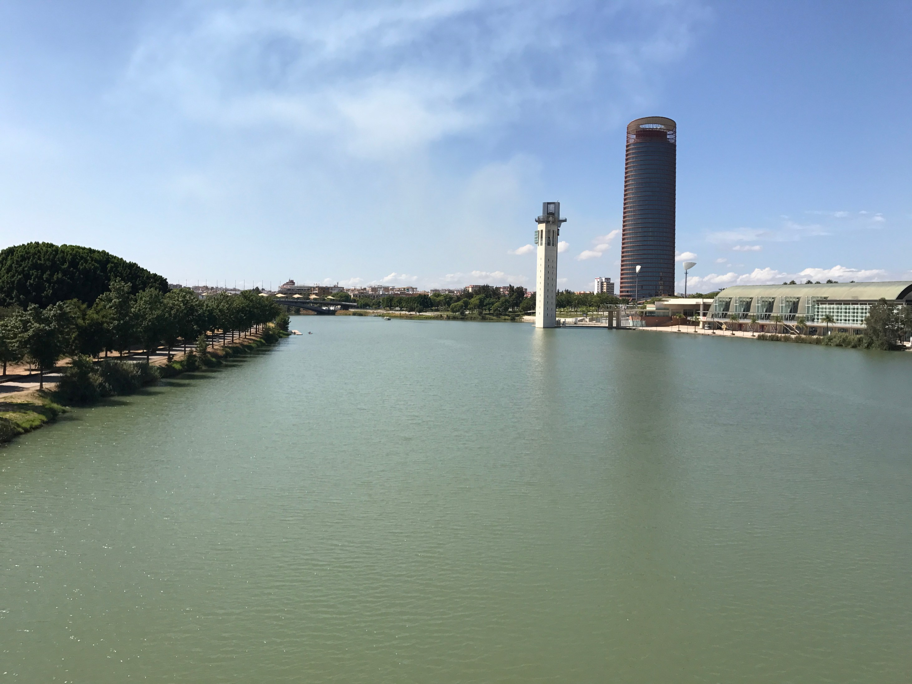

Another week, another post. This week I am going to discuss the importance of taking a break and advice on what do before, during and after you leave. Two weeks ago I took a vacation to Spain and I wanted to talk about some of the benefits I am feeling after the short break.

We all know that taking a break is a great way to refresh yourself and help refocus your mind but at least for me any break shorter than 3 days does not feel long enough.  In my experience, the ideal break is from 7-14 days, less than 7 days feel too short and anything longer than two weeks makes it a lot harder to get back on track when you arrive back.

## **Advice before leaving for your break**

Before you leave there are a few things you should make sure you do:

- Provide an update on your current Work in progress items and provide next steps. This serves 2 purposes:
  - If anybody on your team needs to pick up your tasks they know the current status and what needs to be done next
  - When you come back it gives you a good starting point for what to work on next
- Hand off any tasks you won't be able to complete in time. There is no point in trying to rush through a feature or task if it is is not going to be your best work.
- Enable your Out of office message so others know you won't be available

## **Advice during your break**

You have booked time away you owe it to yourself to not work while you're on vacation. Some people might find some of these tips extremely but I am the type of person that if I am on vacation I do not think about work until I am back.

- Leave your work computer at home or at the office. I know a lot of people who will bring their work computer with them. This is not helping you to take a break. The urge to work or just check email will always be there
- Do not check your work email, if an emergency occurs more than likely you will get more than an email. Having any access to your email won't allow you to fully relax. Also, if you followed the advice above, even if an emergency comes up you're not exactly going to be able to do anything if your computer is at home.

## **Advice on your 1st day of return**

After you have refreshed your body and mind and you are ready to get back to normal. I have found points the easiest way to catch up when I get back.

- Have a catch-up meeting with your team lead or general team as soon as possible. If your team as scrum meetings this can be a good time to get an update.
- Ask a colleague working in the same area if you have missed anything important or if any announcements were made. This allows to catch-up quickly and to know any important news.
- Don't spend your entire 1st-day checking email. I have fallen into this trap before and it can kill any motivation the vacation has helped you get back. Have good email filters setup that way you won't have to check every single email.
- Start back slowly, don't go and kill yourself with 10 or 12 hour day first day or week your back. Take it easy and get yourself slowly back into the swing of things

## **Conclusion**

If you book time off take the time off! It will leave you feeling refreshed and ready to get back to work. I think it is extremely important that everyone takes a break now and again.
