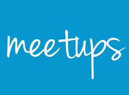

Welcome back guys, this week wanted to discuss the importance Meetups and why you should attend them. If you have never attended a meetup and wondering what it is like the majority that I've attended has a very similar format which is:

- First 15 minutes is your first chance to start talking to people and to introduce yourself
- Next 45-1h is usually one or two presentations about a subject related to the meetup. For example "Debugging NodeJS applications" at a NodeJS meetup or "Introduction to Kubernettes" at a Docker meetup.
- Last 15-30 minutes is your last chance to chat with people and usually have some pizza and beers :).

I have to admit I was sceptical of Meetups so sceptical in fact that I only attended my first meetup this year. Some of the unfounded thoughts I had were:

1. I do not have the time and I won't learn that much.
2. There won't be enough people at the meetups.

After my first meetup, the majority of the concerns I had were gone. I got to meet really cool, smart people and more importantly I got to talk about technology with people that have the same enthusiasm as me.

## **Advantages of meetups**

1. Meet new people that are interested in the same thing as you.
2. Make professional connections at meetups.
3. People are always looking to hire at meetups so you might find your next job.
4. Gain new skills and see new ways to use technologies you are familiar with.
5. By being part of these groups you often get a call for speakers which can be a great way for you to speak about a subject you know well.

## Advice for getting the best out of meetups

By this point in the post you may think meetups are the best things in the world, do not let me fool you. Like everything in life, there are the good and bad parts of meetups Here are general tips for getting the most of meetups:

- Meetup.com is the best place to find a meetup on any subject you are interested in.
- Only attend meetups if the subject really interests you. I know plenty of people that would just go to any meetup that is available. While this might be a good thing to do when your first getting into meetups, you will slowly burn out and not want to go to anymore. Pace yourself!
- During the meet 'n greet parts of the meetup do not stay on your phone alone in a corner. I know this can be hard but the majority of people in the meetups are just like you, go introduce yourself. You are already at the same meetup together so you have that in common
- Follow up with the people you meet at the meetups.
- Watch previous recordings for meetups so you can the idea of the format of them before you attend.

## Conclusion

Meetups are an easy way you can boost your visibility within your community. As somebody once said, "You can be the best in the world but if nobody knows who you are, you will never be the best". Finding somebody you can talk to about subjects you are passionate on is a great experience and it can teach you a lot more about the subject. Now my homework for you, commit to going to at least one meetup within the next month you will thank me later.

Until next time,

Jason
