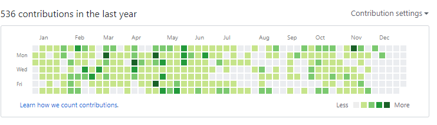

Welcome back guys and I know it has been quite a few weeks since I last posted but been a mad rush towards the end the of the year. This will be the last post of 2017. It feels like I published my [Goals for 2017](https://thedeployguy.com/programmingself-development-goals-for-2017/) like 3 or 4 months ago. I am writing this just as I have returned from on Australia so I have had time to reflect back on 2017 and what I have achieved and not achieved

Last December I wrote [this post](https://thedeployguy.com/programmingself-development-goals-for-2017/) about my 2017 Goal, where I laid out what I was hoping to accomplish during 2017. TLDR Version is my goals were related to improving myself as a developer and improving my communication skills by meeting new people. A little less than one year later and here I am "reflecting" so let’s get into it.

**Goal:** _Code Every Day\*_  
**Result**:

This was one of my biggest goals this year, I didn't exactly "Code every day" with vacation and taking breaks. This was much harder than I expected, especially when you are coding in work. Part of that was to dive into web development and this was a great year to do it. I started the year learning Angular then quickly to Angular 2. This was my first experience with the ‘new’ JS frameworks. Whilst working with Angular I was hearing about [Vue.js](http://vue.js/) and [React](https://reactjs.org/) so I went and built a few projects using each of them. While people might say pick one and master it and I would agree but since I am newish to this framework world I wanted to get a taste of each and how they differed. I think as writing this post my favourite is Reactjs closely follow by Angular.

Just a Tip: If you want to learn a language, a framework very quickly, learn the very basics and start building a project right away. There are things that can only be learned from building a small to a large project.

I am so happy I decided to go on this Coding journey and dive into web frameworks because about halfway through the year I changed jobs. I won’t go into much detail but it wasn’t an “option” to stay with my old team. This put me in the position of having to apply for jobs but lucky for me I had gained a very “hireable” skillset. I wasn’t long looking for a position and I can easily say it was one of the best things that has happened to me this year.

**Goal:** _Create and Release at least 2 side_ projects.  
**Result:** This goal was to give structure to my coding goal, I didn't want to just be coding random things I wanted an end product of my coding and this helped with it. I achieved this goal and I developed and released 3+ projects.

1. GOL habit Tracker - [\[Code\]](https://github.com/TheDeployGuy/LifeGameHabitTracking) [\[Website\]](https://golhabittracking.herokuapp.com/)
2. Escape Character Helper - [\[Code\]](https://github.com/TheDeployGuy/EscapeCharactersHelper) [\[Website\]](https://escapesearch.herokuapp.com/)
3. Zero Waste Shop Locator - [\[Code\]](https://github.com/TheDeployGuy/ZerowasteStoreFinder) [\[Website\]](https://zerowasteshops.com/)

**Goal**: _Meet or catch-up in person with at least 40 people._  
**Result:** I meet so many people this year, way over 40 people. That was one of the selling points for my new role, that you get to meet new people from all the projects we work on. This is a goal I will be continuing into the next year as it makes you take the effort to meet more people and you get to meet so many interesting people.

**Goal:**_Read at least 3 books a month, 1 should be related to software development/programming._  
**Result:** This was one of my failures, I was too ambitious with this goal. I still read quite a few books this year just nowhere near 3 months a month. I will scale back this year but will also make it a  challenge.

**Goal:** Track my time via tools like toggl.com  
**Result:** I started doing this but I slowly realized it was a pain. It was a case of spending time setting up time tracking tools than actually doing stuff therefore wasting time...I have moved to more scheduled my time for projects. Everything goes on my calendar, "if it gets scheduled it gets done".

While overall I think the year was great, I would be deluding myself to say nothing went wrong. Things failing/going wrong is part life, if you failed but learned along the way it’s not a failure it’s part of growing. Einstein once said, “I didn’t fail I have found 1000 ways not to do it”. With that, Here is a list of failures I have had over the last year:

- I wanted to attend more meetups but as the year kept going on and I only attended a handful. I really enjoy meetups and wrote about how important they are here. Next year would be nice to attend more and maybe speak at one of them in the near future.
- Read more books, again I read several books but I love reading I just need time to schedule it. Even a simple habit as "read 10 pages a day" will help hugely.

They were the main goals and results for them that I planned at the end of 2015 for 2016. While I learned a lot and loved all I have accomplished so much I have missed a few of my goals. Reflecting on them regularly allowed me to adjust and make corrections where needed, however, I started to realize that it's hard to "plan" your life a year for now or give yourself goals based on your current position. That is why this year I am going try plan and implement goals on a 12 week basis or every 3 months. This will give me a chance to reassess my goals every 3 months and make adjustments if necessary. I will write a post going more into detail next week.

I hope you guys enjoyed this post, I would really love to hear what you guys did and didn't do in 2017 and what you want to accomplish in 2018. Happy Holidays

Jason
