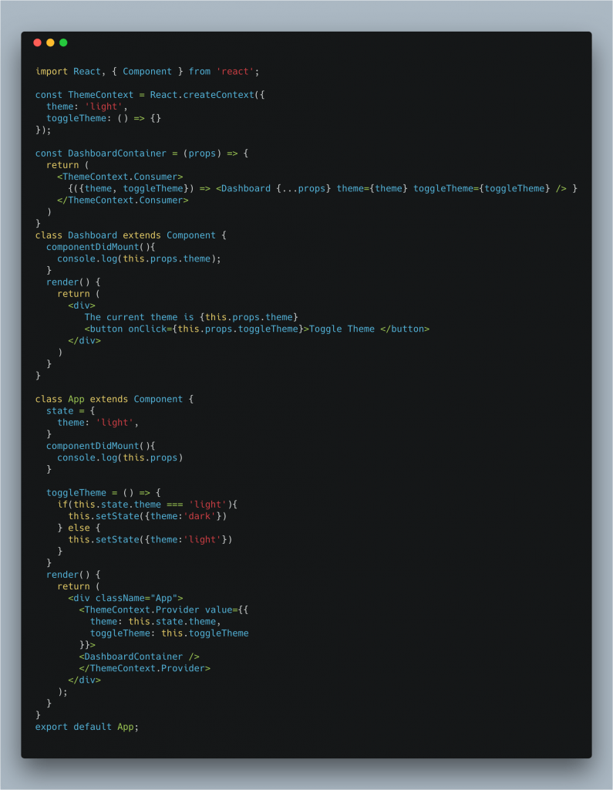

Hey Guys, this week I am going to discussing the React 16 Context API. React 16 was a huge release for react and included a bunch of new feature and improvements one of them being the new context API. I only recently started using it and it takes a bit to get your head around it. I will be discussing what I learned from using it as well as providing some examples.

## What is the new context API?

Context API "provides a way to share values like (certain types of props (e.g. locale preference, UI theme)) between components without having to explicitly pass a prop through every level of the tree." In other words, a common place where you can share values across multiple components. If you have ever used a state management library like Redux you can think of think as mostly the same concept. I should say tools like Redux will have a bunch of other features as well that may help in your bigger applications. However, I think you should see if your problem could be solved with React context API instead of jumping straight to Redux.

## How is it used?

Using the context API is very simple and can be thought of in 3 steps:

1. Create a context object/reference e.g. `const ThemeContext \= React.createContext('light');`. This creates a context for our application to store the current theme value and we set the default as 'light'.
2. Once we have the reference setup the next step is to create a Provider, a Provider provides the contexts value to child components in a tree. Basically, it passes the values down to all the child components, no matter how deep it is any child of the provider will be able to read the value. You can place the value the provider anywhere but for a theme value more than likely every component is going to need to know it so it's probably a good idea to create the provider at the highest level of the component tree and have everything be a child of it. In most cases, we would be defining the Provider in app.js as this is the usual starting point for most applications. Enough talking here is an example: 
3. Now that we have our Theme Value being provided we need some way to consume that value. It is not a regular Prop or a state value so how do we read it? We read it by defining a consumer. We can have multiple consumers for the same Provider context. Here is an example of creating a consumer to get the current theme's value(dark):  Anywhere you need to create what the current theme value is you create a consumer to get the value.

Here is a [link](https://reactjs.org/docs/context.html) to learn more and expand on the example I used. They go into much more detail and have more examples.

## What I learned from using it

This was a learning experience for me, I honestly have never used Redux, I have always tried to manage the state myself and mostly at the top level of my application. For most of my projects, this was perfectly fine, Redux would have been overkill but more recently I have been creating more and more applications that need to share parts of state across multiple components. An example of this would be a mapping application that shows markers on a map for certain locations, the application also has other menus where you can see different metrics about the city itself and the user can choose which city they wanted to view. In this case, the users selected city needed to be shared across multiple components, when the user selected a city to see more information menus/components had to change as well. In the above example, I really struggled to come with a Pure react solution to share this state so I went to look at Redux and was on twitter when I saw this post by Ken C Dotts basically saying Redux should be one of your last options you should try, Context and other statement management strategies should be tried before jumping into redux.

Then I looked into the Context API thinking for 3 or 4 bits of state Redux was overkill, after reading the docs and getting the above example working (sharing the current city across multiple components) I have learned a few things which may help you:

1. Using context with React router is very simple and like above if you need it for every route you can place the provider where you define your routes as I have in the first example. (Wrapped around `<Routes />` tag)
2. One thing I struggled with was I needed a context value in componentDidMount so I could use that value to make an initial fetch request for the component. If you have seen how context work it really only shows how to get the value in the render method. I checked on the React GitHub and found a person asking the same question. The creators of React actually recommended creating a component that reads the values from context then renders your actual component with the value passed as a Prop. Example here:  We are using DashboardContainer to render our Dashboard component and passing the current theme in as a prop so it can be then read in the componentDidMount function or any lifecycle function.
3. Once I was able to read the values and now that they are available in the componentDidMount function (via props) how do we actually update the value? Here is an example of how we would update the theme state for our Dashboard application:  This is our full application, it's easier to explain how the theme is updated. We first have the state in our top-level component App.js which is the current theme and a function to change the theme. We then pass the value of theme and the toggle function into the ThemeContext.Provider as the value, then in the DashboardContainer we are destructing out the theme and toggleTheme function from what the provider passes to us. This allows us to provide theme and toggleTheme as props to the Dashboard component. Then we are displaying the value of the current theme and a button of which when clicked it calls the toggleTheme function from the props. This allows us to change the themes value from anywhere in the React tree pretty cool!

## Conclusion

I hope you enjoyed my first post on Advanced React concepts, I only recently got a chance to use the new Context API was so I thought it would be better for me to start writing about what I learned as soon as I learned it. If you have any questions or comments about the post feel free to reach out on twitter: @jaythewebdev.

See you soon

Jason
