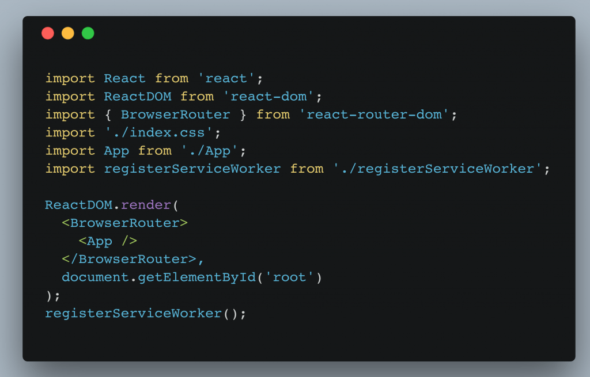
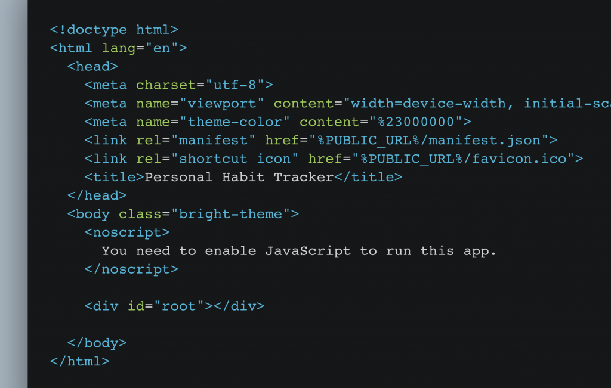
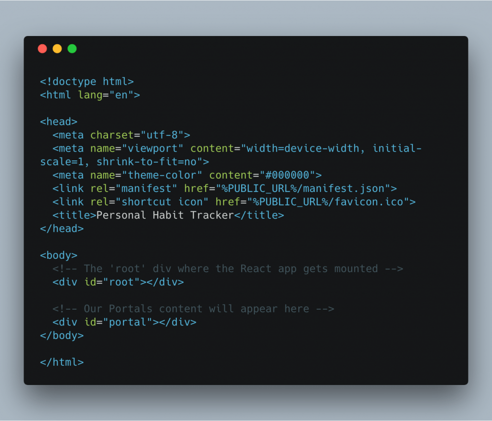
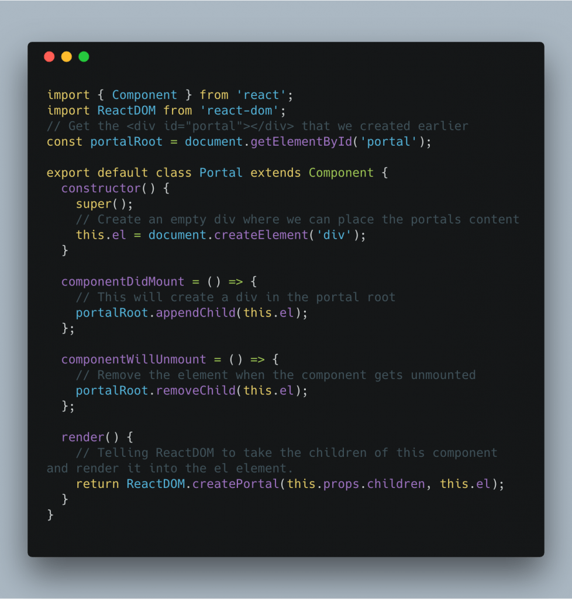
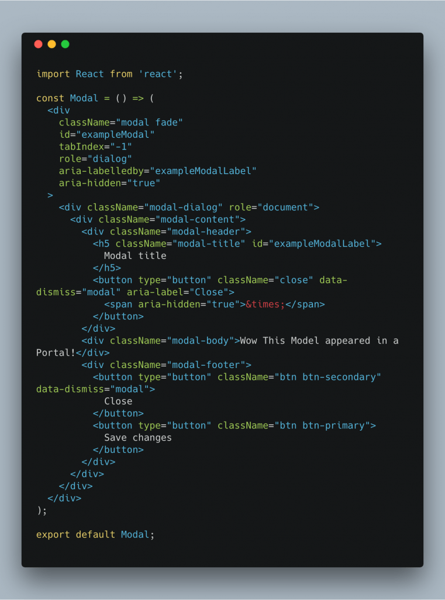
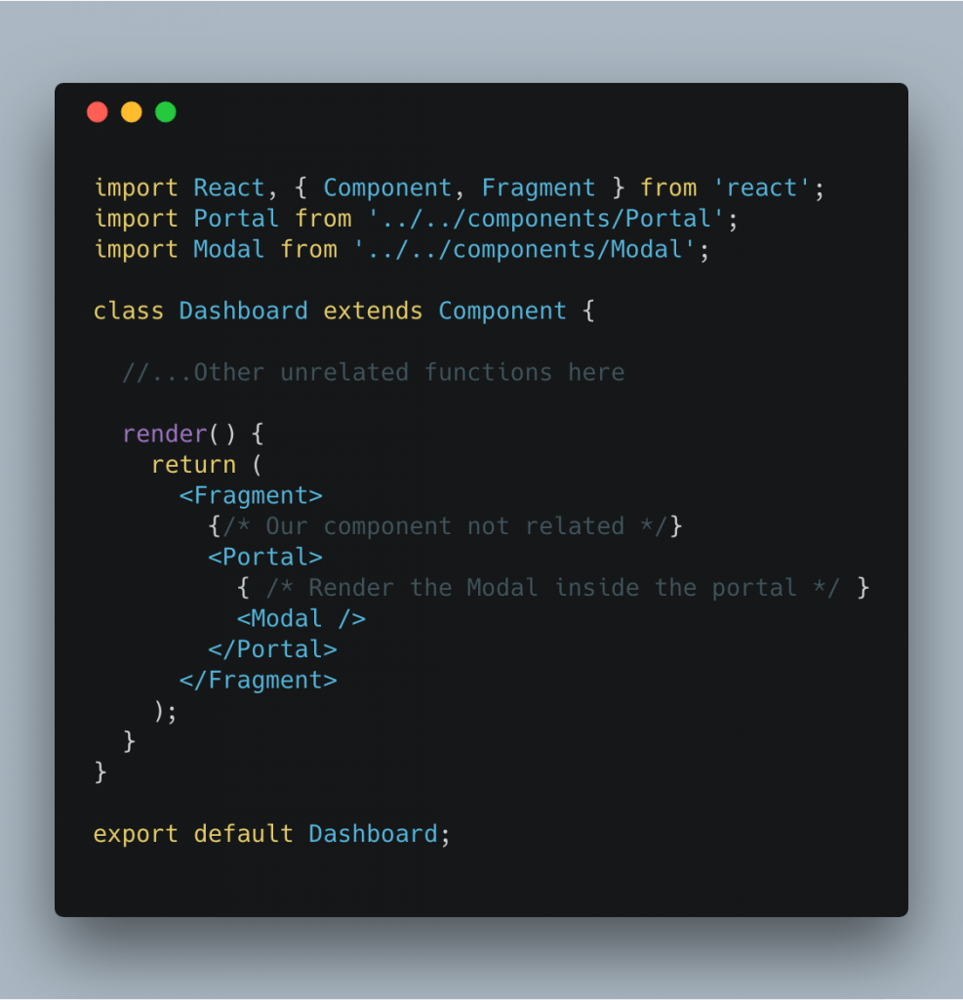
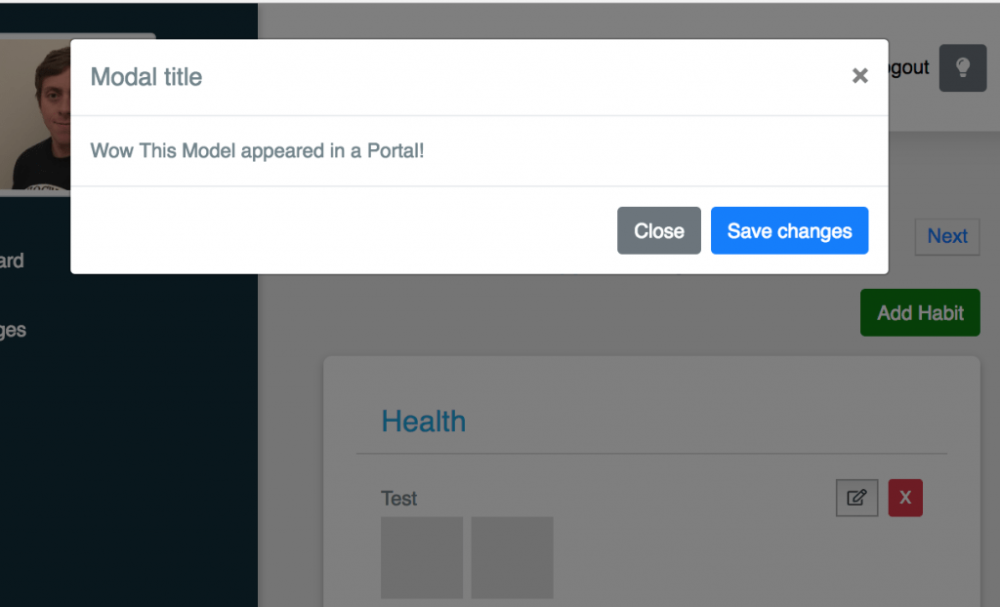

Welcome back guys, on our theme of learning React concepts today I wanted to discuss React Portals. What they are, why used them and then I give you examples and resources to help you understand them better. If you have any questions feel free to reach out to me on [twitter](https://twitter.com/jaythewebdev).

## What are React Portals?

According to the React Documentation "Portals provide a first-class way to render children into a DOM node that exists outside the DOM hierarchy of the parent component." If your not too familiar with React you might not have any idea what that means. In simpler terms in React you usually have this code (usually in a file called index.js):

If you have never seen this file, I wouldn't be surprised this is generated by create-react-app and you never usually need to edit this file. In very simple terms you are telling React(specifically ReactDOM to take your entire application (<App />) and stick it into a DOM element with the id of 'root'. That element is usually in the index.html file as seen below:

Now, where do portals come in? Instead of just having one 

 you create another 
 inside the index.html file with another id e.g. 

. This will be used to somewhat 'teleport' a react element into that div instead of it being in the regular root div like all the other React elements. So why would you want to do that?

## Why Portals?

Portals are extremely useful for things such as models, dialogs or even iframes, i.e when you need to take up the entire screen or mess with the z-index. Before Portals, this sort of thing was very hard to do in React and it cannot be easily done using a regular component as it would just appear in the regular React tree (as a child of a bunch of other elements).

## Creating and using a Portal

As stated earlier to create a portal we need to start by adding a new 
 to our index.html file. I will be using one of my projects to showcase this example: Firstly here is what the index.html file looks like with a new div added(id=portal):

Now we have an outlet for the portal, we need to create a React Portal in Javascript using ReactDOM.createPortal(). We are going to do this in a Portal component in which we can reuse to teleport any element into our portal. Here is what the Portal component looks like with comments in the code explaining what each line is:

We now have an outlet for our portal and a Portal component to transport/portal our elements into, its time to actually use the Portal! I am going to use a HTML Modal for this example, I am just taking the example from Bootstrap:

That is the Modal component created, now its time to bring together the Modal and the Portal. Here is how we do that: 

The result is: 

You can see the portal was able to display completely over the rest of our application making for a better user experience. That is the power of portals and as stated before doing this in React was unnecessarily complicated.

## Resources

I hope you enjoyed my walkthrough of creating a Portal, if you want to dig deeper into Portals here are a few more resources.

[React Docs on Portals](https://reactjs.org/docs/portals.html)

[LevelUpTuts Tutorial on Portals](https://www.youtube.com/watch?v=SVQ2l2w-zPM)

That is it for today guys, I hope you enjoyed this post on React Portals, as stated if you have questions or queriesfeel free to reach out to me on [twitter](https://twitter.com/jaythewebdev).
