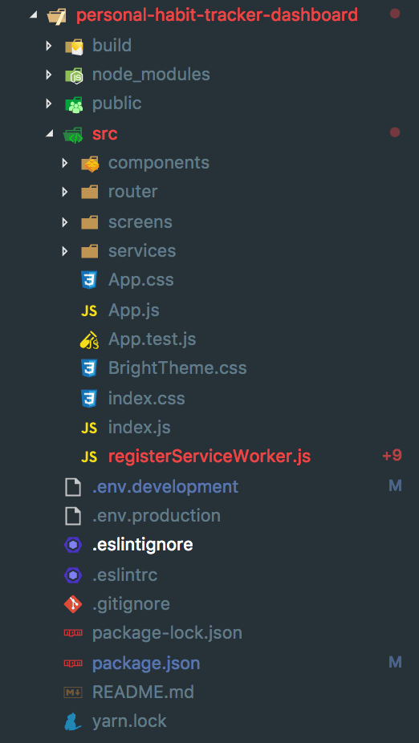
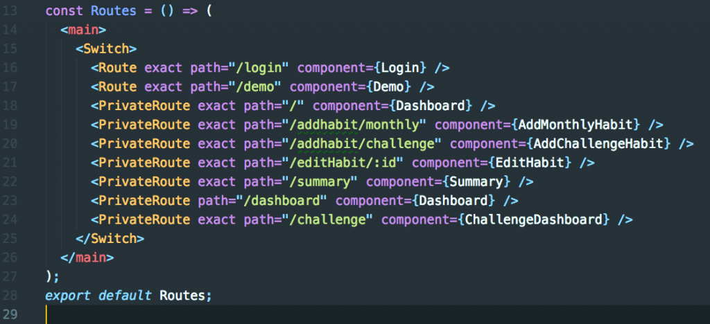
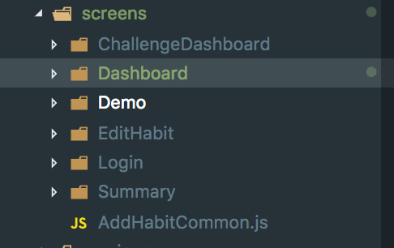

Welcome back guys, this week I wanted to discuss Structuring your React Projects. When you first started learning React, the structure doesn't really matter as you are learning all the concepts and features but as you build bigger and more complex applications your Project structure starts to become important. For particularly huge codebases you can imagine what it would be like to having all your components in one folder or even having them in the same file. Today I wanted to discuss the project structure I have been using for the last while and why I am using it.

## My React Projects Structure

Honestly, I am not going to take any credit for this project structure as my structure is based on Ryan Florence amazing gist found [here](https://gist.github.com/ryanflorence/daafb1e3cb8ad740b346). I am using a slightly modified/simplified version which looks like:

### Structure Explanation

As the gist from Ryan is very long I am going to try to simplify the explanation of the structure and more importantly why I find it so useful. Most of the files are self-explanatory but I am going to focus on the _src_ folder structure.

- _components/_ - This is for components that are going to be used across all parts of the application. Examples of this would be Navbar, Cards and Button components.
- _router/_ - Most of the projects I build have client-side routing. I use React-Router for client-side page routing so anything relating to Routes or the Router go in this folder.
- _screens/_ - This is probably the most interesting part of the structure, screens are different parts of your application. In Ryans gist, he says it's good to have the screens folder structure to match the Routing structure of your application. This means for example if you have a Route for /login you would have a folder in your screen folder called Login which will hold all the components and files used by your login component. For a clearer explanation here is what my routing file looks like: And here is my screens folder structure: 
- You can see there is pretty much a mapping for each route to a different screen. One thing I should mention, AddHabit route is really a subroute of the Dashboard so they would have own files and folder inside the Dashboard screens folder. This has the advantage of if we are working on a feature for the Dashboard we have all the files we need as everything is contained in one place for that specific screen.
- services/ - This is where I put service helper files that are going to be used everywhere in the application. These are network helpers, authentication helpers etc, this is so all the calls can be streamlined into a central service if something in the service changes we only have to change it in one place.
- \_\_tests\_\_ - This folder is missing in my example but this is where all the tests would go, some people like keeping tests next to the components they test but having all the tests centralised is easier for me.

That's it, I highly encourage you to take a look at Ryan gist and get a deeper understanding of why this structure work.

## Conclusion

I hope you enjoyed this article on React Structure while you might not see the value of this type of structure right away as you move into bigger and bigger projects you will start seeing the benefits of a structure like this. By no means am I suggesting this is the one structure to rule them all but this is what works for me and it might work for you. The best thing you can do is find a project structure that suits you and stick to it. Having a familiar structure in all your projects will allow you to work across your projects much earlier. Anyway enough rambling if you have any questions or feedback let me know on twitter [@jaythewebdev](https://twitter.com/jaythewebdev).
