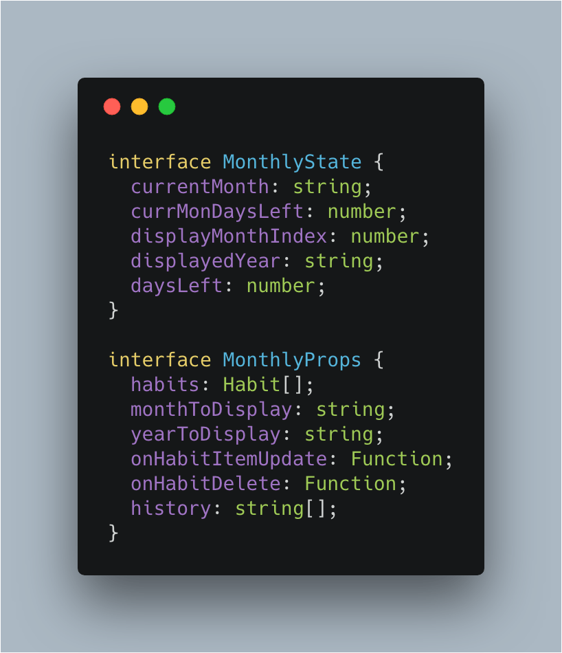
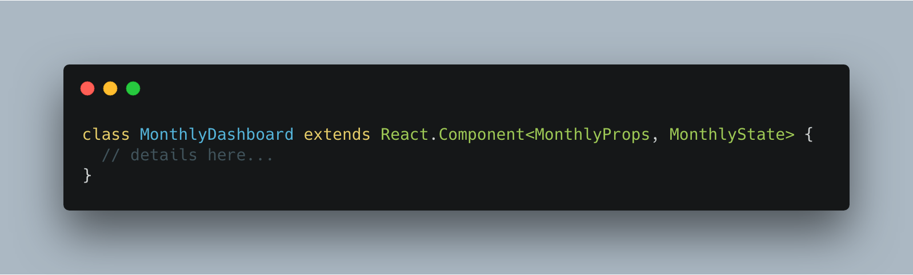
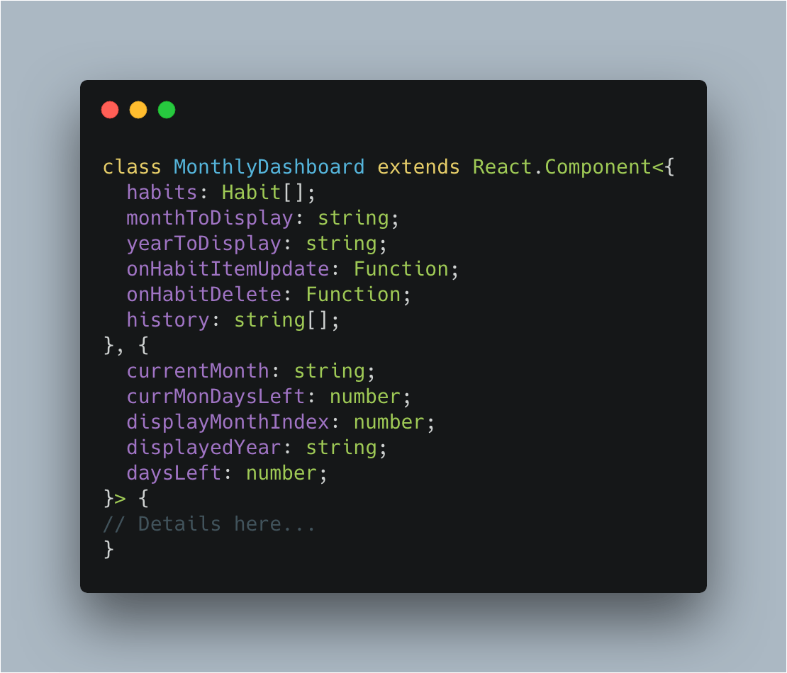
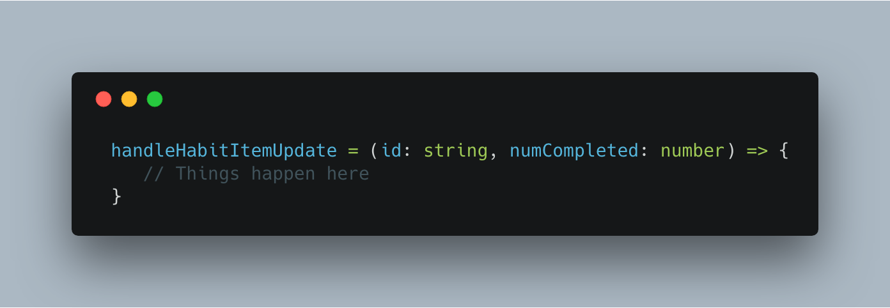
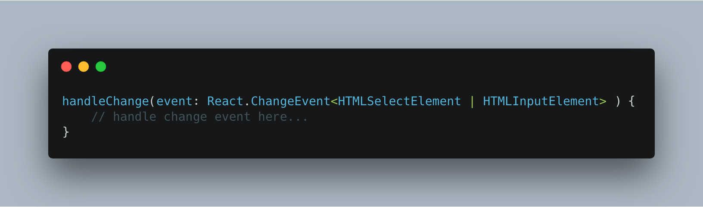

Welcome, this week I am going to be discussing Typescript and What I learned when I converted one of my projects from just JS to Typescript.

### What is Typescript?

Typescript is a typed superset of Javascript that compiles to plain Javascript. In other words, it can be taught of as "just Javascript with added types".  More information about typescript can found on [https://www.typescriptlang.org/](https://www.typescriptlang.org/). Example of this would be instead of `const name = "Jason"` it could be `const name: string = "Jason"`. Again typescript can be smart and infer simple types like above and in most cases, you wouldn't need to give a type a simple string. The power of typescript come from explicit typing on function and other objects, giving types to functions and complex objects allow you to avoid passing wrong types or parameters as if you do it won't compile which gives the developer immediate feedback instead of tracking the issue in after deployment.

### **Why move the code base to Typescript?**

There are a few reasons why I want to move my code base to Typescript:

- Typescript popularity is exploding and will continue to explode into 2019. In [Stack overflow yearly survey](https://insights.stackoverflow.com/survey/2018/) typescript is in the top 5 of the most loved languages developers love to use. It is also topping many people list as the language to learn in 2019. Some people are even saying that all the JS code they write in the future will be written in typescript.
- In my new role @Jet, most of our codebase is written in Typescript so it would be good to have a project outside work that uses it so I am able to learn the language quicker.

### **Things I learned**

The project I choose to convert to typescript is the project I have been using as a playground my [Habit Tracker application](https://github.com/TheDeployGuy/personal-habit-tracker-dashboard). It is a standard react application that was built using create-react-app (before the support for typescript). Luckily create-react-app newest version has built-in support for typescript and upgrading the versions was very easy. I won't go into details on doing the actual conversion as that can be found elsewhere I want to discuss what I learned/lessons:

- Types for packages you are using will need to be installed. ["Definitely Typed](https://github.com/DefinitelyTyped/DefinitelyTyped) is definitely one of TypeScript's greatest strengths. The community has effectively gone ahead and documented the nature of nearly 90% of the top JavaScript projects out there." For example, @types/jest @types/react, @types/react-router-dom would all need to be installed if you wanted to use typescript with react and react-router.
- Tsconfig file will need to be configured. Create-react-app will helpfully generate a .tsconfig file for you but you will need to customize it for your needs one thing that tricked me is with imports. In the normal settings imports in typescripts have to be configured like: 'import \* as React from "react";' but you can use the regular synthetic imports e.g: '
  import React from "react";' if you need the setting "allowSyntheticDefaultImports" set to true inside the ts config file.
- Declaring and using State and Props types can be done in a few ways
  - Interfaces or Types (showing interfaces)  They are used like so: 
  - Inline 
- Functions with typed parameters are extremely useful.  For the above function, if you try to pass a number for id or a string for numCompleted, typescript will tell you and it won't even compile. You can see that this allows you to avoid you passing the wrong type.
- Form event types are complicated. A very common way of capturing input from the user in forms is to use a handleInputChange function as seen below: Types for this type of function can be many, an input, a mouse input, a select input etc so how is this handled. The dirtiest way is to just type is as any but this will not work if you have strict mode enabled in your tsconfig file another option to use the multiple type operator which is |. See an example below: 
- Prop-types are completely replaced by typescript. Prop Types was helpful giving him error messages if you passed a bad type but typescript is another level above.

### **Resources for getting started with Typescript**

Here are some of the documents and repositories that helped me to learn typescript.

[Typescript Official Docs](https://www.typescriptlang.org/docs/home.html)

[React Typescript Cheatsheet](https://github.com/sw-yx/react-typescript-cheatsheet)

### Conclusion

I hope you enjoyed the first post of 2019, I am excited to be working in typescript if you have any tips or suggestions about using typescript let me know!

Until next time,

Jason
