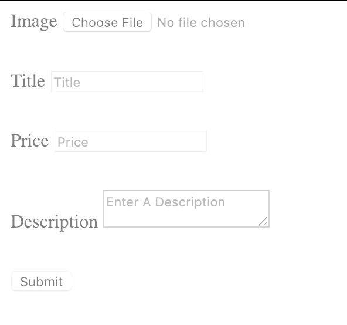

Welcome back, this is going to be a short post on a DevTip I recently learned from Wes Bos Advanced React course which is Disabling Form inputs using a fieldset.

Disabling a Form input can be useful disabling the user from resubmitting the form more than once, it also disables the user from editing the information while the form is being submitted. So How does it work?

<iframe id="cp_embed_WPEgzN" class="cp_embed_iframe " style="width: 100%; overflow: hidden; display: block;" title="Fieldset Disabled" src="https://codepen.io/jaslloyd57/embed/WPEgzN?height=265&amp;theme-id=dark&amp;default-tab=html%2Cresult&amp;user=jaslloyd57&amp;slug-hash=WPEgzN&amp;pen-title=Fieldset%20Disabled&amp;name=cp_embed_1" name="cp_embed_1" height="265" frameborder="0" scrolling="no" allowfullscreen="allowfullscreen"></iframe>

As you can see from the codepen above it has the disabled attribute and if you try and click any of the fields within the form you can't you also cannot click the submit button which is great. This doesn't require any additional CSS and it comes built-in with HTML. I have added minimal styles to make the labels and input display block, if we add this simple line of CSS:

```css
fieldset[disabled] {
  opacity: 0.5;
}
```

When a form has a disabled attribute we basically set the opacity of the form to make it look like it is loading. The result is the following: 

Obviously, you can go crazy with CSS and make it look 100x better but with minimal HTML and CSS, you can make a very useful accessible form. I hope you enjoyed this DevTip until next time.

Jason
