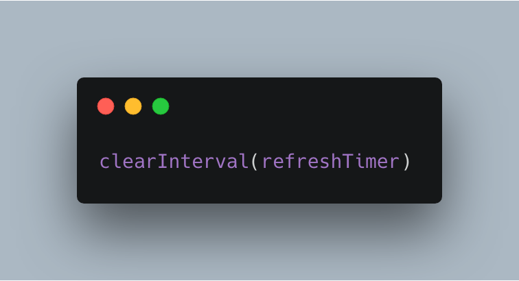

Welcome back, this week I have another DevTip. My team had a situation in the past few weeks where we wanted to enable an auto-refresh feature for a dashboard homepage which required making a network request to the backend to get the new information. So every 60 seconds we would make a request to the backend and display the new results on the page. I am sure you have written this type of code before. It looks something like:

Then to avoid memory leaks you would usually assign this to a variable like so:

Then when the user navigates away from the page or closes the tab you would clean up the timer like so:

The above was a simplified version of what we first implemented but one important thing, the request we were making was pretty expensive for the backend to run. By implementing this refresh timer we were now hammering it every 60 seconds which could cause issues with the backend since we are running an expensive query.

We wanted to keep the refresh timer as it was very useful for the users of the Dashboard but we wanted to try to reduce the load on the backend by avoiding any unnecessary requests. Looking around one of my colleagues suggested looking into the "[Page Visibility API](https://developer.mozilla.org/en-US/docs/Web/API/Page_Visibility_API)".

If you have never heard or learned about the Page Visibility API, it allows you to detect when the user navigates away from your application. i.e: minimizes the browser window or tabs away from your website. If you think about that is a very useful thing to be able to tell inside your application e.g why perform a network request when the user is not on our site or has the window minimized.

We decided this would help us avoid unnecessary calls when the user was off doing something else even within our application. When they come back to the tab or window we are able to detect that using the same Visibility API and start the timer again. That sounds awesome, so how does it work?

See the Pen <a href="https://codepen.io/jaslloyd57/pen/exVXYg/">Page Visibility API</a> by Jason Lloyd (<a href="https://codepen.io/jaslloyd57">@jaslloyd57</a>) on <a href="https://codepen.io">CodePen</a>.
 

As you can see if you switch tabs or minimize the window you can see in the console that we have stopped the timer and when we come back it starts again!

I hope you guys enjoy this post if you have used this API before and you have any other tips let me know on [twitter](https://twitter.com/jaythewebdev).

Jason
