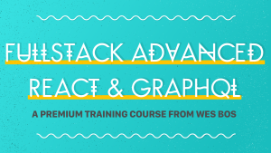

Welcome back guys, today's post is something different, it is a course review. I have never done a course review before but I just recently finished a course and wanted to review it.

The course I am speaking about is: [Wes Bos's Advanced React](https://advancedreact.com/), in short, it is a course that will teach you how to use React with GraphQL. You will build an e-commerce store called Sick Fits that uses React on the frontend via Next.js. It also goes into building the backend using Nodejs to serve as the GraphQL server. There is much more included in this course but the main reason why I wanted to take this course was to learn GraphQL and more specifically using it with React.

## More on the course

The course starts with getting set up with Next.js (React framework with Server-side rendering). Moves into Styled components from there you get into client and server-side with GraphQL. From there you move into Authentication, User permissions and Accounts then adding support for Stripe checkout by building a Cart from scratch. It then ends with Testing and Deployment of the application.

The full course consists of 68 Videos divided into 10 modules. The name of the modules can be found on the [AdvancedReact.com website](https://advancedreact.com/).

## My thoughts on the course

Overall it is a very well put together the course, Wes did an awesome job and you can see he really worked hard on creating and producing the course. It had a few aspects of the course I didn't like/would like to have seen changed but TLDR; I would recommend it to anybody looking to get into GraphQL.

### What I liked

- The actual application you build is a professional grade website, you could see it being a real-world e-commerce store.
- Next.js introduction is great, you get exposed to a different way to build react applications. Next.js is extremely simple, comes with a router already built in and does Server-side rendering out of the box. Wes does an awesome job explaining what it is and how it works.
- Loved seeing the testing section included, it is something that often gets skipped over during programming courses.
- Shows you the basics of using [Cloudinary](https://cloudinary.com/) which is an awesome place to host your images and not worry about resizing or compressing as Cloudinary does it all for you.
- Support is available via a Slack channel once you buy the course.
- Step solutions for every video are very helpful.

### What I disliked

- The course is very long, I watched it on 2x and it still took some time to finish. I feel like some of the videos could have been shorter or not included.
- The process of creating GraphQL queries/mutations is very repetitive (this is not Wes fault) but I feel like it could have been skipped over/condensed.
- There are some parts of the videos were Wes says 'Go and try code this yourself and come back to the video' I would have liked to see more of that throughout the course especially since writing GraphQL queries/mutations is very repetitive. However, I also understand that people don't necessarily have the time to do that.

### What I would have liked to see included:

- The testing section is great but it is done right at the end, would have loved to see a more TDD approach as you build the components but I understand it was done for timing.
- Typescript support, I took the entire course in typescript (e.g I set it up myself and just did the necessary Typescript things). It would have been nice to see starter files for typescript although I know this is a big ask.
- More focus on the CSS - Most of the CSS is already pre-built, you just have to import and use them. I completely understand why Wes did this and the course is already long enough but I think there are some cool aspects to the design that he could have highlighted more.

## Conclusion

Overall I loved the course, I had a LOT of trouble with getting typescript to work 100% but in the end, I mostly got it but that was my own mistake for using typescript. Wes did an awesome job and I will buy any future courses he makes that interest me. If I was to give one piece of advice for getting the most out of the course it would be:

**Do not follow the course exactly**, instead of creating an e-commerce store create something else that interests you(that may or may not have the same aspects). I plan on taking my Habit Tracker application and integrating it with GraphQL and React so I can learn and get through the experience on my own. If you would rather take the course then **Don't only take the course**, once you finish the course build something else using the exact same technologies and see how it goes. (This is the secret to really learning this stuff.)

I hope you guys enjoyed the post if you think you would like to learn GraphQL/React or even Next.js please support Wes and buy is course he did an awesome job!

Until next time

Jason
