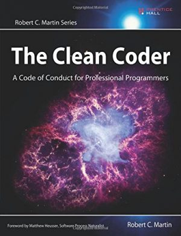

Welcome back, this week I am going to be discussing a book I recently read 'The Clean Coder' by Robert C. Martin. I am a pretty big fan of Bob Martin 'Clean Code' book and I would consider it a required read for any software developer. While the focus of Clean Code is mainly technical and on producing high-quality code, The Clean Coder, on the other hand, is about some of the soft skills around being a software developer. Bob mentions several times that this book is about being/becoming a professional.

## Key Takeaways

While there is a lot to take from this book and different parts will connect with different people depending on your current situation. I am going to focus on the points that connected with me.

DISCLAIMER: There are things in this book I do not agree with and the author even states that not everybody will like or agree with what he has to say but you will still get value. After that let us jump into it.

### Understand the Domain/Team

"It is the responsibility of every software professional to understand the domain of the solutions they are programming"

"Professional programmers take the time to understand the business. They talk to users about the software they are using. They talk to sales and marketing people about the problems and issues they have. They talk to their managers to understand the short- and long-term goals of the team."

These points really jumped out at me, I think as Developers sometimes we have this disconnect between tech and business. Business Analysists connect with the business people to create requirements for the developers, whilst this is great for developers as we can focus on the building it can create a disconnect/gap between the code and the business.  I think as stated, as a professional, it is your job to understand the domain you are working in. I also think you should use the product that you are building in the environment your users are using it in, talk to your users, marketing people and Project managers all the time, this will provide you with invaluable feedback and helps put you directly in your users' shoes.

### Bob Martins *minimal* list that every software professional be **conversant with**

The book mentions a *minimal* list of the things that every software professional should be **conversant with**:

- Design patterns. You ought to be able to describe all 24 patterns in the GOF book.
- Design principles. You should know the SOLID principles and have a good understanding of the component principles.
- Methods. You should understand XP, Scrum, Lean, Kanban, Waterfall, Structured Analysis, and Structured Design.
- Disciplines. You should practice TDD, Object-Oriented design, Structured Programming, Continuous Integration, and Pair Programming.

While this might seem like a lot you mainly should be aware of how they can be used and probably more importantly where they shouldn't be used and their limitations.

### Your career is *your* responsibility

"Your career is *your* responsibility. It is not your employer’s responsibility to make sure you are marketable. It is not your employer’s responsibility to train you, or to send you to conferences, or to buy books for you. These things are *your* responsibility. Woe to the software developer who entrusts his career to his employer."

The start of this bears repeating "Your career is *your* responsibility", nobody will look after your career for you, you have to be constantly pushing yourself forward, always learning. He also mentions "It is not your employer’s responsibility to train you, or to send you to conferences, or to buy books for you" I think in the last few years, employers have been trying to attract talent by providing many of things above and the author mentions that if your employer does provide these benefits, you should be grateful and use them.

### Making Changes in the Code

"When do you make easy changes? *All the time!* Every time you look at a module you make small, lightweight changes to it to improve its structure. Every time you read through the code you adjust the structure. This philosophy is sometimes called *merciless refactoring.* I call it “the Boy Scout rule”: Always check in a module cleaner than when you checked it out. Always make some random act of kindness to the code whenever you see it."

While "The Boy Scout Rule" sounds cheezy it is an admirable goal and I think that all software engineers should aim for it. Do you see something you don't like or understand in the code? Then make it better be "Merciless" in your changes, if you find it confusing other people will find it confusing too so make it better. If you are not comfortable making changes in your codebase then your codebase is complex. One of the ways to enable merciless refactoring is to have tests for your code. If there are no tests, start writing them for your team this is a great way to check code cleaner/better than when you found it.

### On Saying Yes

"Professionals are not required to say yes to everything that is asked of them. However, they should work hard to find creative ways to make “yes” possible. When professionals say yes, they use the language of commitment so that there is no doubt about what they’ve promised."

I don't have much to add from what is said above, basically use yes as a commitment not as a maybe, if you think it cannot be done make sure that is well known, professionals do not lie they also don't give up, they find a way to make yes **possible.**

### Leaving Meetings

"Over the years I’ve developed a simple rule: When the meeting gets boring, leave."

I love this, how many meetings have you been in where about 10 minutes in you realize you don't need to be there. He makes a great point "...if it gets boring or you find yourself not needing to be there just leave." This might seem a bit harsh but he says you are paid to do your job if a meeting will have no meaningful impact or doesn't contribute to your role just leave. If your Boss asks why you are leaving meeting you have a valid reason, you can simply ask do you think I was needed in that meeting and explain why you weren't.

### Handling Pressure

"The trick to handling pressure is to avoid it when you can, and weather it when you can’t. You avoid it by managing commitments, following your disciplines, and keeping clean. You weather it by staying calm, communicating, following your disciplines, and getting help."

Pressure exists in every job, so I think the advice above applies everywhere not only in software development. Again the main point is to Stay Calm, you will get through this, communicate with your team/boss to let them know what is going on.

## Conclusion

That is all for my takeaways from The Clean Coder, I enjoyed reading the book and it contains a lot of great information for any level of developer. I hope my key takeaways can help you in some way.

Until next time

Jason
