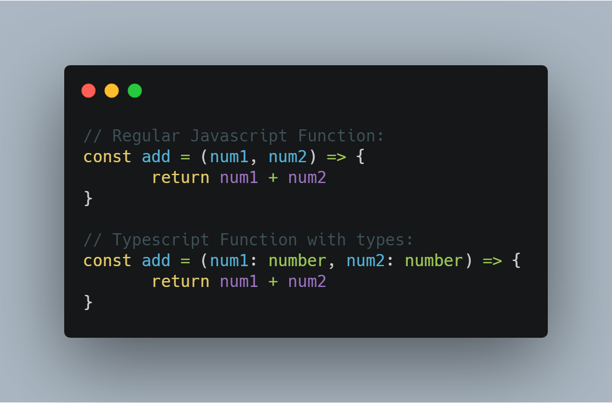
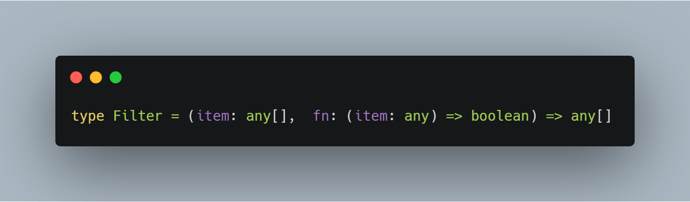
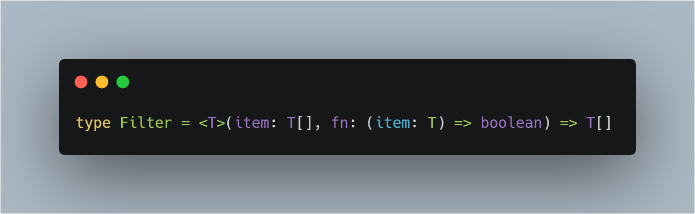
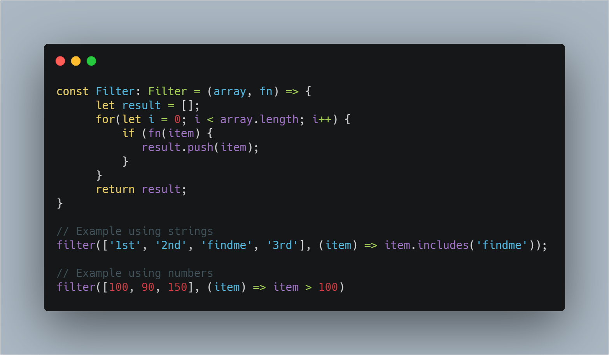
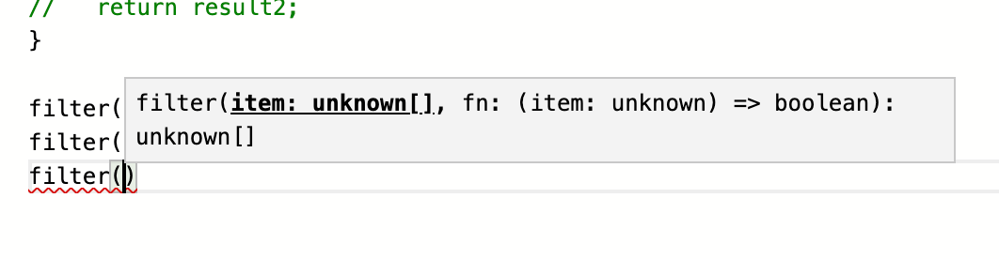
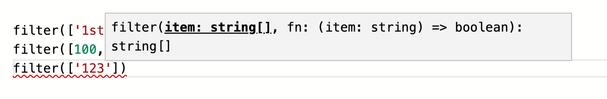
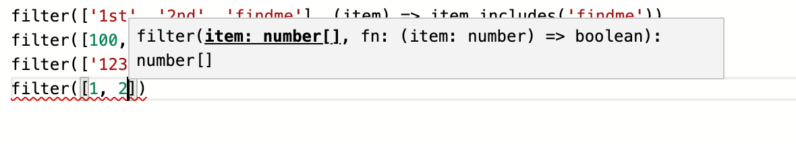

Welcome back, over the past year or so I have been diving into Typescript mainly because of my position at Jet/Walmart. We heavily use Typescript on my team, we are a big believer of using type safety to decrease bugs and overall development time. Anyway, enough of you should use Typescript speech, I want to discuss Simple Generic Types in typescript.

### **What are Generics**

"Generics are a placeholder type used to enforce a type-level constraint in multiple places. It is also known as a polymorphic type parameter."  - That might sound a bit cryptic but the simplest way to think of it is "Generics are a placeholder type". Let's use an example:

If you have not seen typescript before, you probably shouldn't be reading this post but essentially it is saying the parameters to the add function must be numbers. In regular js, you do not have the type safety so you could do this: add({ objectVal: 2}, false}) and you will not see an error until runtime. If you try to do the same in Typescript it will show you an error straight away and it won't compile so you will see the error right away. You also see the type the function expects straight away.

#### **Why use Generics**

That solves the case for a simple function with types that are simple enough but what if you have a more complexed function that could take a variety of types, for example, the array filter function, if you have used it before you know you can pass an array full of any type of data (strings, objects, booleans, numbers, etc) and a function used to compare each value against, it then returns a filtered list.  How would we go ahead and type something like that:

In the first attempt we might put **any**: 

However, while this works it doesn't provide us any information when we use it, it just tells us that we can pass anything while this is true it is still unsafe, also most people agree you should avoid any in 99% of cases. Things like the filter function would be used in a lot of places so it would be useful to have types.

This is where we can use Generics: 

This may look very weird, what the hell is this T type, this is how you declare a generic in typescript. Every time you see a generic think of it as a placeholder. This type states that it is a function takes an array of items of T type, it also takes a function that has a parameter of the same T type and returns a boolean. Then the entire filter function returns a filtered array of type T. If you go through that sentence and replace T with string or number you get the idea of a generic.

Using our Filter type:

// Show picture of TS compiler unknown becoming String etc Typescript will give you a lot of help when using generic types, vscode will also provide you with a lot of information. Here is how it looks:

It starts off as unknown:  As soon as you put the first entry in your array you can see typescript updates the unknown to types to known types e.g (strings for this case). The number example is also below.

This is why generics are extremely useful.

**What is this funky <T> before our function declaration? **

<T> tells typescript where to scope the generic, there are only a few places where you can put the angle brackets, one of them is before the function declaration, the other place you can put it is as part of the Type alias e.g: type Filter<T>  = (item: T\[\], fn: (item: T) => boolean) => T\[\]. However doing this would require us to bind a type explicitly when we used Filter e.g let filter: Filter<string> = (array, fn) => { } but then we could only filter strings and we would need to declare another one for numbers, objects, etc so it wouldn't  be very useful for our use case.

### Conclusion

When I initially saw Generics in Typescript most of the examples I have seen around have been complicated, I hope my simple example helps you understand generics a bit more. Generics do get more complicated, such as having more than one generic (a common convention is to use <T> and <U> for the first two generics), it is the exact same concept as single generics, it is just another placeholder. I won't go into much more detail in this post about them I may write more about it in the future but until next time Au revoir.

Jason
