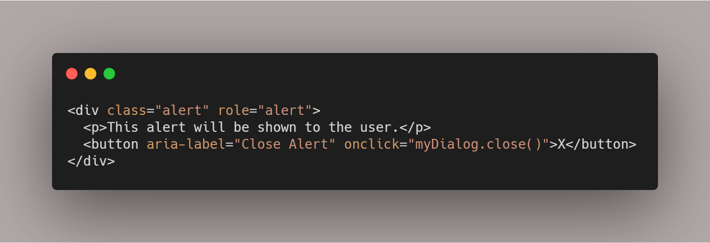
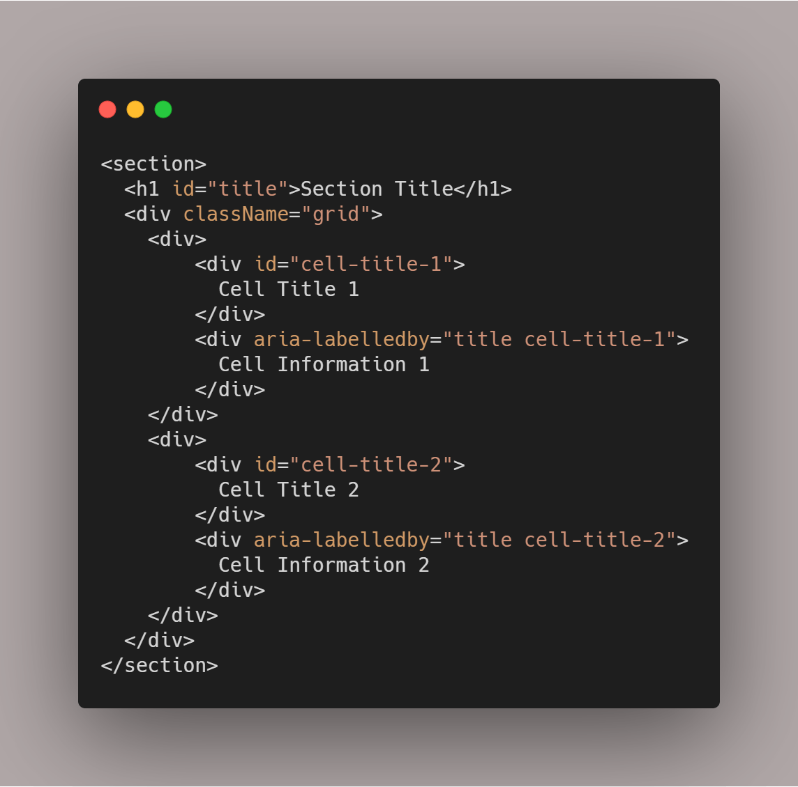

Welcome back to the series on Web accessibility, if you haven't read the previous post on [Semantic HTML](https://thedeployguy.com/accessibility-semantic-html/). This week post is about ARIA or WAI-ARIA, which is

> Accessible Rich Internet Applications **(ARIA) **is a set of attributes that define ways to make web content and web applications (especially those developed with JavaScript) more accessible to people with disabilities. - [Mozilla](https://developer.mozilla.org/en-US/docs/Web/Accessibility/ARIA)

## Why use ARIA?

Using the right Semantic HTML can make our web applications more accessibility but there are situations where there isn't a "right" semantic HTML tag for what we are building. You may be building something completely custom like:

- A collapse Tree view
- A custom input control such as a Dial
- Alert Modal
- Tabbed UI

This is where ARIA comes in, aria gives meaning to elements that normally wouldn't have any. It is used by Screen readers and other accessible technologies to provide more information to the user.

## What exactly is in ARIA?

Now we know what AIRA is and why we should use it lets get into what is in the aria spec. ARIA defines semantics that can be applied to elements, it is subdivided into roles, states, and properties that are supported by a role.

### Roles

Roles help define the specific type of user interface element, e.g alert, table, grid button, checkbox, link, tab, switch and [many more](https://developer.mozilla.org/en-US/docs/Web/Accessibility/ARIA/ARIA_Techniques)...now you may notice that many of these roles have built-in Semantic HTML elements, that is on purpose. Again if you can use the built-in elements,  they automatically come with these roles built-in. However, since you may need to build a custom version of them you can specify a role that can help the browser treat it somewhat the same.

### States and Properties

ARIA attributes or properties help identify various properties of screen readers and other assistive technologies, an example of an aria property would be "aria-label" it allows us to associate a label to an element that wouldn't normally have one.

ARIA States helps the screen readers identify various states of an element/application. Elements can have various changing states e.g. checked, disabled, collapsed, expanded pressed, etc and users that are visually impaired may not necessarily see these various states. ARIA provides these states to allow us to tell screen readers and other assistive technologies that inform the users about the various changing states of our application.

I am going to go through some examples in this post most of the common ones you see, I will then tell you about the best resource for when you need to use different aria roles, state, and properties.

### Examples of ARIA

The below example uses both a role attribute and aria-label, we use aria-label in this case because a screen reader doesn't know what X means, therefore, using aria-label gives this element more meaning. Role tells the screen reader and this section has a role of Alert so treat this as an alert instead of just a generic group element.

Below is a simplified example from a project I was working on recently, it is a snippet of code that had a title and had a grid of read-only information. Now, a grid is technically a table and we could use an <table> element to display this information. In my case, I needed flexibility in the way the grid was laid out so <table> wasn't really an option. The aria authoring practices do have advice for building a table like component but I want to keep it simple.

Tangent aside, what aria-labelledby does is, it allows us to associate elements that wouldn't normally have an association. It also us to associate more than one element, so for example when a screen reader comes across "Cell Information 1" it should read "Section Title, Cell Title 1, Cell Information 1" thereby giving the user more information about the element.

#### When do we use aria-labelledby over aria-label?

> You should use aria-labelledby if the text is visually on-screen somewhere and this form is preferable. You should only use aria-label when it’s not possible to have the label visible on screen. - [Source](https://www.symphonious.net/2010/12/07/aria-labelledby-vs-aria-label/)

As stated above the ARIA attributes I used in the examples are some of the most common you will see around the web, however, the best resource for learning more of them is [WAI-ARIA Authoring Practices](https://www.w3.org/TR/wai-aria-practices/). This document can be used as a go-to resource when building a custom component. They have examples of some of the most common custom components you cannot build just using semantic HTML tags.

## Conclusion

The first rule of ARIA is to not use it! This is even referenced in the spec, if you can use regular semantic HTML elements then you do not need aria, it is for the custom components you build. Also, just like anything, ARIA is great as long as you only use it when it is needed and for what it is needed, it is possible to overuse it and end up creating a worse experience. I will discuss some tools that we can use to see the effect of ARIA later in this series but for now, I hope you enjoyed this post on ARIA.

Until next time,

Jason
