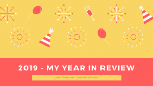

Every year I do a My Year in Review (loosely focused around Career and Technology), here is [last years.](https://thedeployguy.com/2018-year-in-review/) 2019 is coming to an end and as the new year is approaching I try to look at the year that passed and discussing what went well and what didn't go so well. This post is more for me than anybody else so feel free to ignore it ;).

## What went well

- Promoted to Tech Lead at Walmart - This was probably one of biggest achievements this year, I have been on the path to becoming a tech lead over the past few years so it was great to finally see it happen. I still have a lot to learn but grateful to be in this position.
- Read 12 Books (Non - Fiction) - I think 12 is a perfect number of books to read per year, I did have previous years where I read much more but I would rather read fewer better quality books and apply the principles I learned.
  1. Why we Sleep
  2. Ego is the Enemy
  3. The Productivity Project
  4. [The Clean Coder](https://thedeployguy.com/the-clean-coder-my-takeaways/)
  5. [A Philosophy of Software Design](https://thedeployguy.com/a-philosophy-of-software-design-summary-part-1-cp1-cp9/) ([pt2](https://thedeployguy.com/a-philosophy-of-software-design-summary-part-2-cp10-end/))
  6. I will teach you to be Rich
  7. Digital Minimalism
  8. Essentialism
  9. Seneca on the Shortness of Life
  10. Programming Typescript
  11. Peak Performance
  12. Bounce
- Wrote 12 Blog posts - I am cheating a bit because this is number 12, I did a lot of book reviews post this year which was great.
- Finished [Wes Bos Advanced React Course](https://thedeployguy.com/wes-bos-advanced-react-review/). I have a post about it [here](https://thedeployguy.com/wes-bos-advanced-react-review/), but **TLDR**; it was a great course on GraphQL, and I would highly recommend it.
- Finished a Udemy course on [PWAs: Progressive Web App (PWA) The Complete Guide](https://www.udemy.com/course/progressive-web-app-pwa-the-complete-guide/). I meant to publish a post reviewing this course but never got around to it. PWAs are a very interesting topic and thinking how far the spec has come is amazing.
- Dove Deeper into [Accessibility](https://thedeployguy.com/accessibility-semantic-html/) - Accessibility is a huge topic, I feel like I have only scratched the surface.

## What didn’t go well

- Didn't do enough programming work outside work, in 2018 I completed 2 rounds of ‘100 Days of Coding’ this year I didn't do very much. Not to make excuses but being promoted ended up involving a bit more work than I thought and I ended up being mostly drained at the end of day. Next year I really want to dig into a wide range of technologies especially ones outside my comfort zone.
- I felt like I worked pretty hard this year and I think I got burnt out once or twice, so next year I need to avoid that. When I do get burnt out it impacts everything I do not just my day to day work.

It was a quick year, hard to believe I am at Jet.com (now Walmart) over a year now, I have enjoyed the work I have done so far and next year seems to be even more exciting. I look forward to tackling 2020 with you guys.

Happy Holidays and Happy new year!

Jason
