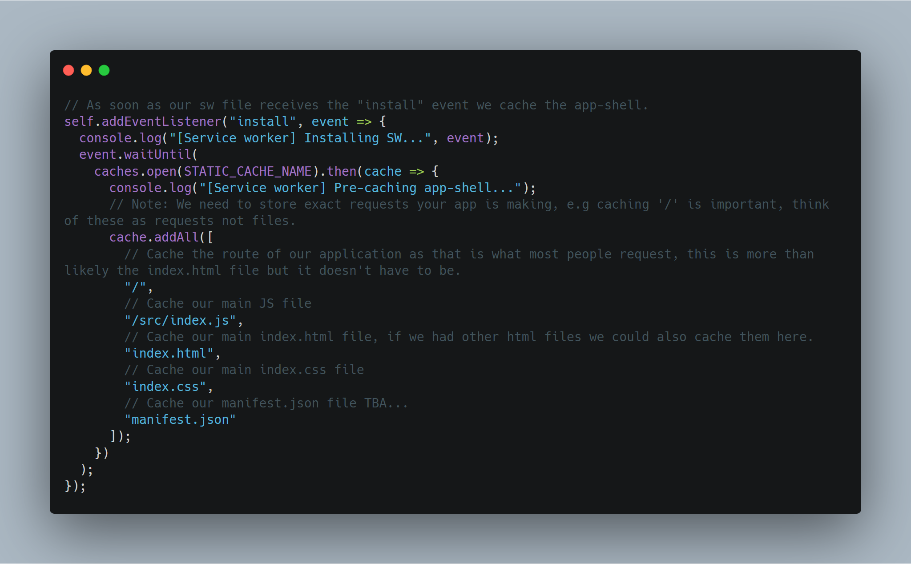

Welcome back, recently I took a [course on Udemy](https://www.udemy.com/course/progressive-web-app-pwa-the-complete-guide/) about service workers. This was an excellent course and I highly recommend it. To solidify my learning I wanted to write a blog post series on creating a service worker from scratch by building our own simple custom application from scratch using Vanilla JS. This is a introductory post to Service Workers, by the end, you will have a simple application that works offline.

## The Application

As this is a blog series on Service Workers, I want to keep the application very simple. The application will be a Learning Tracker, proudly called TIL - Today I learned. This fits in well as we are going to be learning about service workers.

The finished application will look something like this:

As you can see it is very simple, you have an input where you can type what you learned and when you click enter it gets saved to the History section. This section shows what you learned and when you learned it. While this seems a bit simple for including a service worker / Offline support, it is actually the perfect candidate for getting your feet wet. It will include, installing a service worker, caching asserts, serving cached assets and making it work offline!. Let's get started!

## **Requirements**

1. Install the latest Node LTS version [here](https://nodejs.org/en/)
2. Download the starter template here. \[insert link\]
3. Open the repo in your favourite code editor (I will be using vscode)
4. Open the terminal and run _npm install_
5. In the terminal then run _npm start_ and you should see the start template application running in your browser.

A note on the starter template - It is built in vanilla JS and since these posts will focus on creating a service worker I have also provided the CSS and HTML needed within the starter template.

### Step 0: Creating a manifest.json file

// TODO: Insert Details about a manifest.json file.

### Step 1: Creating an sw.js file at the root of the repository.

For now, just create it at the root of the repository and leave it as is. Creating it in the root of your repo causes the SW scope to control all of your application.

Websites can have more than one service worker but for our use case we are only going to need a main service worker file called _sw.js_, this is a common name for the main service worker file.

**Note on Scope**: if you have different parts of your application you can use different service workers to control different parts/scopes of your application.

### Step 2: Registering our SW file

Now that we have an _sw.js_ file we have to link it somewhere so our application knows about it. The best place to do this is in the index.html file. There are two ways to do this via the index.html:

1. Create a `<script>` tag in index.html and add the service worker registration code there.
2. Add the service worker registration code to your main index.js file.

Since we have an index.js file already linked in our HTML we can place the registration code there.

// TODO: Insert explanation of this a bit...

#### Step 2.5 Testing service worker registration.

Open Chrome, open dev tools and go to the application tab. You should now see the service worker registered under the Service Worker menu!

### Step 3 Listening for the install event

Earlier we had code that registered our service worker file, after the SW is registered an install event is published (The `install` event is the first event a service worker gets, and it only happens once. (If a new version of the service worker is available the install event will run again), in our _sw.js _file, we need to listen for the \_install_ event.

As this event only happens once and it the first event a service worker can listen to, it is the perfect place to start caching assets for offline support.

#### Step 3.5 Caching our App Shell

The app shell is basically the necessary (mostly static) files / asserts needed to see our website to function i.e the application frame. This will include HTML, CSS, images and JS files, the exact details of app shell will differ from App to App but for our very simple app we will only need to cache a few files.

**Note**: Any framework-specific files like bootstrap files, fonts or anything like that should/can be cached now as well. We can cache remote asserts the exact same way we cache local assets by just providing the URL.

Please take a look at the comments in the code, as each line is explained a bit more. **TLDR**; We are caching all our app shell files, which includes our only HTML CSS and JS file.

##### Verifying our files cached.

Opening up chrome dev tools, under application -> Cache Storage, we can now see our assets are being cached!

If you try our app offline now, you will see that it still doesn't work...well that is normal just because we have the assets cached doesn't mean the browser will serve them up. Lets see how to serve up the cached assets.

### Step 4: Serving our Cached files

When you visit a website, the browser goes through your page and 'fetches' all the resources you link within your pages (very simplified). When a user is offline what happens? The browser still tries to request the website to get the necessary files and it fails because the user is offline. This is where your service worker can come into play. The service worker allows us to listen to these fetch events and intercept what happens and make it do something entirely different e.g serve up a cached version of that asset. This is exactly how we are going to make our app work offline.

Please take a look at the comments in the code, as I think it is best explained on the line so you can easily see what each line is doing. **TLDR**; We intercept / overwrite the fetch event from the browser, if we find the requested file in our cache then we served the cached asset if we do not find the file we make a network request via fetch for the requested resource. (A.K.A: Cache with Network fallback)

If you were to now open our application in a new tab, open dev tools and check the network tab you will see this:

If you take a look at the Size it says ServiceWorker, meaning it is now being served by the service worker which is serving it from the cache.

What?? I am online why am I getting the cached assets? Well look at the code, we mention nothing about offline in the service worker, we are just saying no matter what the situation is if you find the file in the cache serve it. This is the recommended way of doing it as it is very powerful. Firstly, users do not have to request the same files again meaning the loading is pretty much instant, it also saves on network bandwidth as you are serving files on the device which is awesome!.

This approach is great but it has one problem, as stated in the code, what happens if we update index.html or the CSS file?...well since it is cached locally on the user's device the user will not see the new files which is a huge problem. This is where versioning the cache comes in.

#### Versioning the Cache

As mentioned above, we have to version the cache if we want users to get updated assets. The simplest way of doing this is having a static cache(s) defined at the top of the file and just incrementing the version every time you update the assets. If you check code earlier in the post we have `const STATIC_CACHE_NAME = "static-v1";` if we changed any of the assets we would have to change the name to something like `const STATIC_CACHE_NAME = "static-v2";`

Since we are using this variable to determine what cache the assets are served from when it is updated that new cache won't exist so it has to reach out to the network to get the updated assets, which will then, in turn, be cached in '_static-v2_'.

This might seem a bit of a pain and it kinda is, there are tools and services out there that kinda automated this part of the service worker for you. I am not going to discuss any of them in this post but there are easier ways. We are also taking a simple approach to caching, in that we invalidate the entire cache when maybe only one filed changed so there are better ways to do it.

One thing you may notice if you open up your dev tools at this point is that for every new cache we create we leave the old cache lying around. This is not a good idea, we should clear up old caches as soon as a new one is used, it is important to do that because every asset is taking up some space.

#### Cleaning the old caches

We know we have to clean the cache so let us see how. Where do you think is the best place to clean up old caches? When I was first learning about service worker I taught the best place to do would be in the install event, since that is where we are caching the new assets. While that was not a bad guess this has a huge problem, imagine you have two windows or two tabs open, they visit your site in a 3rd tab the new service worker gets installed and the new assets are cached and now the old cache is gone, we have broken the other two tabs/windows if we were to go offline because the cache they were using is now gone. So we need to clean the old caches when the user closes all tabs of the site and opens up a new one?? How are suppose to do that?? - Well luckily for us service workers have an event we can listen to.

The event is called '_activate',_ which only gets activated when the user closes all tabs and pages and opens up a new one, so it is the perfect place to clean up old caches. Here is the code we use to listen to the '_activate'_ event and clean up the cache

**TLDR;** Take all the caches that the browser has for our site if it doesn't match our current cache delete it. (Obviously, this is a very simple example of caching)

Note: There are many strategies of caching in service workers I only discussed the 'Cache with Network fallback' strategy. Each type of cache is best used in different situations.

### Step 5: Testing Offline mode in our application

We have now set up all the required steps in order for our application to work offline! Let's stop talking and give it a go. There are many ways you can test offline connection in Chrome, I am going to show you one (via the service worker tab)

Now refresh the page (ctrl + r or command + r) and....boom!! Our site is still available.

As you can see our application works offline! and the assets are still being served from the cache. Now with our offline app, we can enter a new TIL and they will show up in the history section. Now they won't be saved as we do not have backend serving this and we do not have dynamic caching but I think this is a perfect place to end this post!

## Conclusion

I hope you enjoyed this post on an Introduction to Service Workers by Building a simple TIL application that works offline. I introduced you to installing a service worker, listening to events then I showed you how to cache the app shell, discussed versioning and cleaning up your cache then finish the post by having a fully working offline application. Now as I stated this is only an introduction, I haven't dug deeper into dynamic caching and integrating this with a backend. I will write follow up posts diving deeper into service workers when I do write them I will be sure to link them here.

Until next time,

Jason
