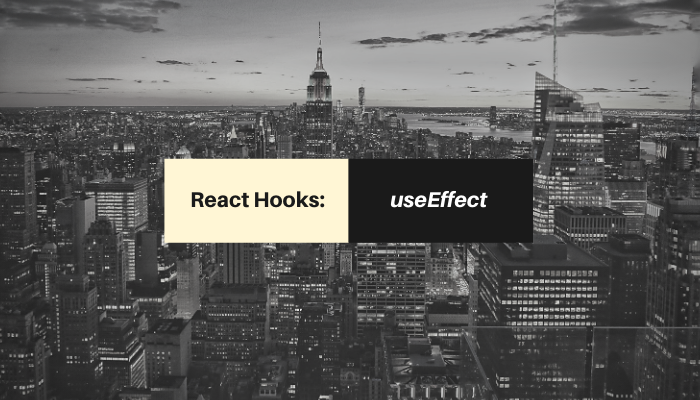
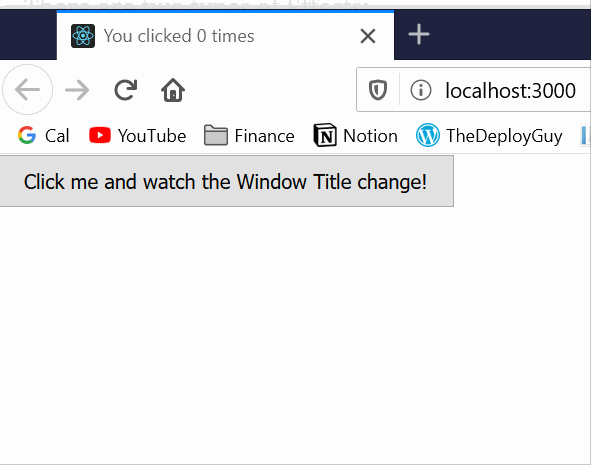
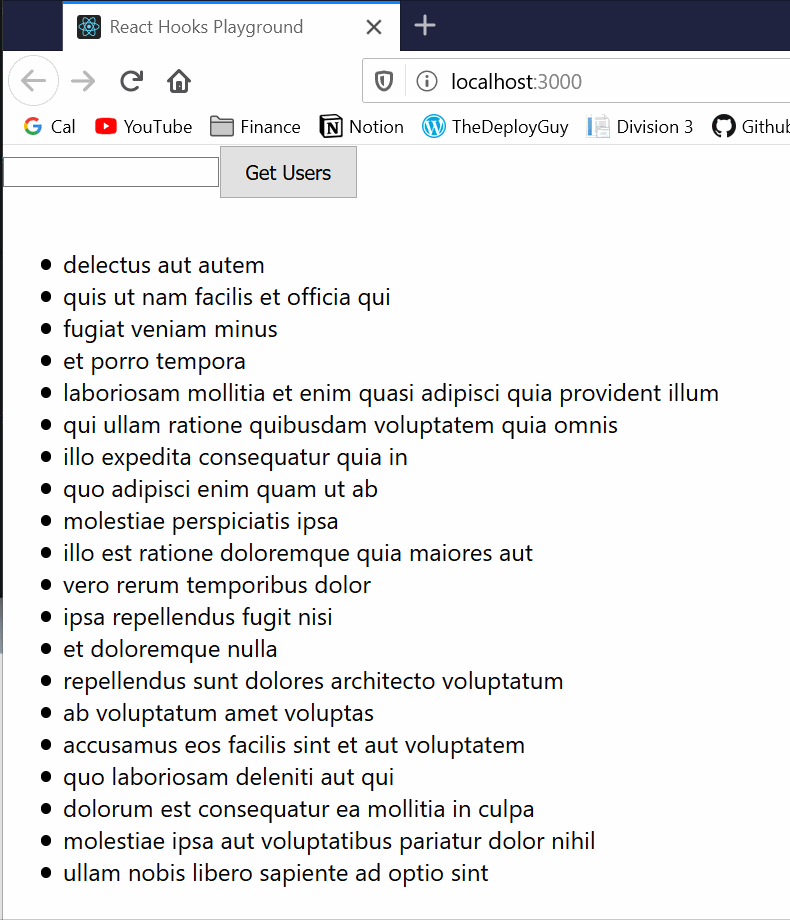

This is the second post in the series on React Hooks, previously we discussed [useState](https://thedeployguy.com). I am going to try keep this as short as possible so here we go:

- Lets you preform side effects in function components.
- useEffect is `componentDidMount`, `componentDidUpdate` and `componentWillUnmount` combined.
- It runs something _after_ render!
- By default it runs after first render and after every update, (there are ways to control it, see below)
- useEffect takes a optional 2nd parameter which is an array of dependencies that will cause the effect to re-run. Instead of running after every update it will only run after any of the dependencies change.
- Unlike `componentDidMount` or `componentDidUpdate`, effects scheduled with `useEffect` don’t block the browser from updating the screen.
- There are two types of Effects:
  <!-- TODO: Add link to Effect without cleanup -->
  - Effects without Cleanup
    - Manual DOM mutations
    - Fetching Data
    - Logging
      <!-- TODO: Add link to Effect with Cleanup -->
  - Effects with Cleanup
    - Subscriptions / Event listeners

## Effects without Cleanup

### Manual DOM mutations

```jsx
function TitleUpdate() {
  const [clickAmount, incrementClicks] = useState(0)

  useEffect(() => {
    document.title = `You clicked ${clickAmount} times`
  })

  return (
    <button className="App" onClick={() => incrementClicks(clickAmount + 1)}>
      Click me and watch the Window Title change!
    </button>
  )
}
```



### Fetching Data

Making a network request (note: Hooks are not the final solution to making network requests in React, Suspense is coming for that).
I have added comments into the code on some gotchas you need to be careful with.

```jsx
function TodosApp() {
  const [todos, setTodos] = useState([])
  // This will run on every single render!! (And gets you into a nasty loop)
  useEffect(() => {
    // The function that you pass into useEffect cannot be async. It must return a cleanup function or nothing.
    const fetchData = async () => {
      const result = await fetch(`https://jsonplaceholder.typicode.com/todos`)
      setTodos(await result.json())
    }
    fetchData()
  })

  // ...

  // This will only run after the first render
  useEffect(() => {
    const fetchData = async () => {
      const result = await fetch(`https://jsonplaceholder.typicode.com/todos`)
      setTodos(await result.json())
    }
    fetchData()
  }, []) // Providing an empty array means run only after the first render or this function had no "dependencies" requiring it to rerun.

  // ...

  // This will only run after the first render then only when the searchUserId state changes, defaults to '1'
  const [searchUserId, setSearchUserId] = useState("1")
  // This is to avoid sending a request every time we type in the input
  const [searchText, setSearchText] = useState("1")
  useEffect(() => {
    const fetchData = async () => {
      const result = await fetch(
        `https://jsonplaceholder.typicode.com/todos?userId=${searchText}`
      )
      setTodos(await result.json())
    }
    fetchData()
  }, [searchText]) // If the query dependency changes rerun this function

  const handleChange = e => {
    e.preventDefault()
    setSearchUserId(e.target.value)
  }
  return (
    <div>
      <input type="text" onChange={handleChange} />
      <button onClick={() => setSearchText(searchUserId)}>Get Users</button>
      <ul>
        {todos.map(todo => (
          <li key={todo.id}>{todo.title}</li>
        ))}
      </ul>
    </div>
  )
}
```



## Effects with Cleanup

### Subscriptions / Event listeners

Subscriptions / Event listeners should always be cleanup when they are not needed that way we can avoid memory leaks.

```jsx
function SubscriptionApp() {
  const [todos, setTodos] = useState([])
  useEffect(() => {
    const handleVisibilityChange = () => {
      // Do something when the user either tabs out of your site.
    }
    // If you do not know the Page Visibility API I have a post on it here: https://thedeployguy.com/reducing-unnecessary-network-requests-using-the-page-visibility-api/
    document.addEventListener("visibilitychange", handleVisibilityChange)

    // This is the cleanup function, that will run after the component is unmounted .... (like componentDidUnmount)
    return () => {
      document.removeEventListener("visibilitychange", handleVisibilityChange)
    }
  })
}
```

## Conclusion

Well, that is _useEffect_, I hope you enjoyed this post, you will be using _useEffect_ everywhere in your application. As you use it you will become more familiar with its in and out.

Until next time,

Jason
