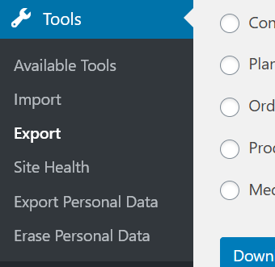
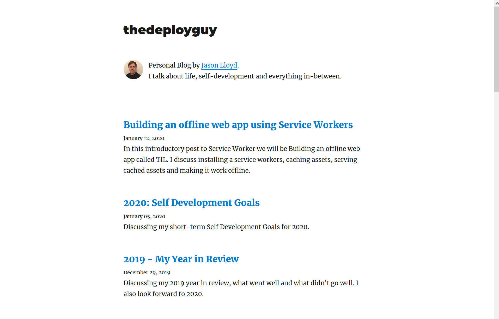

Welcome back, this is the second post on migrating a WordPress Site/Blog to Gatsby. I am in the process of migrating this blog to Gatsby so I taught it would be good to document the process. Today I am going be discussing how to migrate/export posts from WordPress into Gatsby.

While there are various ways to getting data out of WordPress, I am going to be discussing one main way that will automate pretty much all of the work. The way it is going to work is:

1. Export Data from in the WordPress UI into xml.
2. Use [wordpress-export-to-markdown](https://github.com/lonekorean/wordpress-export-to-markdown) to go through the xml documents and generate the markdown files.
3. Take all this folders and import them into `content/blog`.


## Exporting Data from WordPress

Exporting data from WordPress is pretty easy if you use the UI, on your WordPress Wp Admin Dashboard go to Tools > Export:


In this menu you can choose what exactly to export, since this is a blog I only care about exporting Posts so I could just select that but for safety let's pick 'All content' and click the 'Download Export File'

Depending on how many posts you have this may take an extra couple of seconds but once it is done you will have a backup of all your posts in xml. Now that we have done that it is time to convert them to Markdown.

## Using wordpress-export-to-markdown to Generate markdown Posts.

We are going to use the file we generated in the last step along with a tool called wordpress-export-to-markdown to transform this file into Markdown files. In order to use the tool we are going to need to install `npx/npm`. If you have ever installed node.js you npm will come with it, if not google `install nodejs` I won't go through this as I want to keep the tutorial focused. Lets start:

1. Open a terminal navigate to where you have blog backup file downloaded. In my case it is `Downloads`.
2. Run `npx wordpress-export-to-markdown --input=thedeployguy.WordPress.2019-12-28.xml`, when you run this a wizard will come up asking you a bunch of questions. Each of this will be custom based on your wordpress setup but here is what I choose:
```sh
$ npx wordpress-export-to-markdown --input=thedeployguy.WordPress.2019-12-28.xml

Starting wizard...
? Path to output folder? output
? Create year folders? No
? Create month folders? No
? Create a folder for each post? No
? Prefix post folders/files with date? Yes
? Save images attached to posts? Yes
? Save images scraped from post body content? No
```

3. Once you run that command you should have all your posts converted into Markdown!

If you look at the format the post it looks very similar to how the sample posts look in the `content/blog` directory e.g: ``output\2018-04-22-2018-my-year-so-far-goals-progress-report\index.md. If you open one of the sample posts you will also see that frontmatter has been added to the posts i.e the tool provides and pull the metadata for your posts. 

## Importing markdown posts into new blog.

Now we have the posts in a format gatsby can read the only thing left to do is to move the export files into `content/blog`. If you have been following along using the terminal you can do the following: `mv -p output/* my-blog/content/blog`. (replace the locations and names of your blog folder).

They should be all in the right place now, run 'npm start' wait for the development server to come up and voila you should now see all your posts!



A few things, you may want to double check some of your posts, the first time I ran this tool it has issues with pulling some of the images. If the images are corrupt or broken simply download the image from your WordPress site and sick it into the correct folder.

## Conclusion

That is it for the second post about migrating WordPress to Gatsby, this was a post on pulling data out of WordPress and converting it into Markdown. Doing it this way saves a lot of time by instead of going into each of your posts and exporting them individually it is done in bulk and it is converted automatically. Well now that the majority of the hard work is done in the next series of post we are going to be adding some polish to the blog, I hope you join me there.


