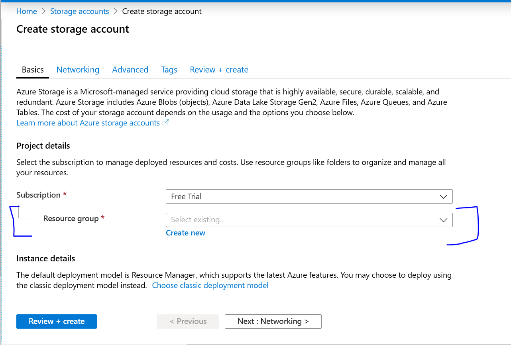
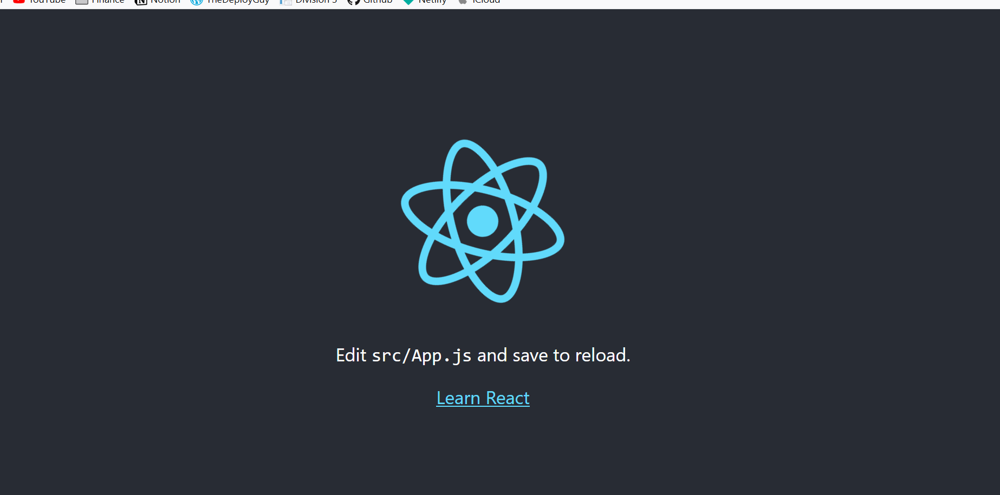

Welcome back, in the last series of posts we discussed migrating a Wordpress blog to Gatsby and then we deployed it to Netlify. Personally, I think Netlify is the best platform to deploy a static website but there are alternatives. Today I am going to be discussing Azure Blob Storage and specifically hosting a static website on it.

## Azure

Azure is another cloud computing platform like AWS, IBM Cloud or any other one you may be familiar with. It provides a set of cloud computing services that can do just about anything. The great thing about Azure is they will give you 12 months of services for free! You can sign up for a free account [here](https://azure.microsoft.com/en-us/free/)

Azure provides hundred of different services as stated I am going to be focusing on one Blob Storage.

### Blob Storage

#### What is Blob Storage

> Azure Blob storage is Microsoft's object storage solution for the cloud. Blob storage is optimized for storing massive amounts of unstructured data. Unstructured data is data that doesn't adhere to a particular data model or definition, such as text or binary data.

Blob storage is part of the storage account service, to create a storage account we need a resource group. A resource group is a logical container into which Azure resources are deployed and managed. Lets create a storage account and a resource group:

1. Once you have signed up for a free account, navigate to the [portal](https://portal.azure.com/#home)
2. Click 'Storage accounts' under the Azure services section.
3. Click 'Add' on the Storage account page
4. On the Create Storage account page Under Resource group click create new like so:

5. Under instance details give your storage account a name e.g: 'staticweb'
6. Select a location closest to you
7. Leave all other options default and click 'Review + create'
8. Once the validation passes click 'create'
9. In about 5 - 10 minutes you should have your Storage account created.


##### Enabling static website hosting
1. Under the storage account you created in the last step click the instance you just created.
2. In the left menu click 'Static Website' like so:

3. Toggle to Enabled and give an Index Document name as: index.html.
4. Click Save

Once that is completed you will be provided with a Primary and Secondary endpoint for your website. If you visit them nothing will show but let's fix that by uploading a simple index.html file.

##### Uploading to Blob Storage

There are a few ways to upload to blob storage, I am going to show how to do via the portal and how to do it via the command line. The portal is useful if you only need to change one or two files, if you are uploading an entire site folder I recommend using the command line. Lets get started with the portal:

1. Under your storage account click the instance you just created.
2. In the left menu under Blob service click 'Containers'
3. A container should exist called $web, this gets automatically created when you enabled static website hosting in the last step. Click $web
4. Create a simple html file (open an editor, copy the content below and save it as index.html)
```html
<!DOCTYPE html>
<html lang="en">
<head>
    <meta charset="UTF-8">
    <title>Azure Blob Storage Example</title>
</head>
<body>
    <h1>Hello from Azure Blob Storage</h1>
</body>
</html>
```
5. Back on the $web container page click 'Upload' and select the index.html file you just created
6. Click upload
7. Give it 2 or 3 minutes and revisit the primary endpoint you were given earlier and you should see the html file we created being served!

We have successfully hosted our one file website, lets now host a more complex React application.

##### Hosting a SPA React app on Blob Storage

Hosting a React / Angular or Vue application is no different, at the end of the day these frameworks produce a build that results in a bunch of javascript, css and html files with the main entry file being index.html just like our simple application. In theory you can take that entire build folder, upload it to azure blob storage and it should just work*

* If you are using a client side router then you need to do some work with Azure CDN to allow routing to work. This is because when blob storage sees `/products` it looks for a product file and Azure CDN will allow you to change that behaviour. [Instructions here](https://medium.com/@antbutcher89/hosting-a-react-js-app-on-azure-blob-storage-azure-cdn-for-ssl-and-routing-8fdf4a48feeb)

Let's deploy a React application to Blob Storage:

You will need nodejs and npm installed to do the following:

1. Open your command line / terminal, run `npx create-react-app azure-static-test`
2. Once completed run `npm start` and you should see the starter application running locally. Lets get it up on Azure blob storage now
3. Run `npm build` this will create a production build of your application, it will output the files to output/ folder. Once that is done we are ready to upload the entire build folder to blob storage.

Uploading via the portal one file or folder at a time is a pain so lets do it via the command line / terminal:

We are going to need to install azure-cli, the instructions can be found [here](https://docs.microsoft.com/en-us/cli/azure/install-azure-cli?view=azure-cli-latest)

Once installed lets make sure it is working and lets get it connected to Blob storage:

1. To confirm it is setup correct run `az account list`, if your account list details are shown then it is working correctly! If not go back to the installation link and set it up again.
2. Run `az storage account keys list --account-name <insert storage account name>`, this will display auth keys which we will use in the next step.
2. Setup environment variables to connect to blob storage, open your command line / terminal and create the following environment variables:
```
AZURE_STORAGE_ACCOUNT="<insert storage account name>"
AZURE_STORAGE_KEY="<insert one of the keys value from step 3>"
```
3. Go to where your react project is e.g Documents/azure-static-test, run the azure storage batch upload command `az storage blob upload-batch -d $web -s Documents/azure-static-test/build`, this will upload everything in the build folder which is the production version of our site.
4. Once that is all done visit the primary endpoint and...Boom!:


We now have a React application hosted on Azure Blob Storage

Note: You do not have to use the command line if you are using Vscode you can deploy directly from there instructions are [here](https://docs.microsoft.com/bs-latn-ba/azure/storage/blobs/storage-blob-static-website-host)

## Conclusion

I hope you enjoyed this post on Hosting a static website on Azure Blob Storage, we got a brief introduction to Azure and Azure storage accounts, we then hosted a simple index.html, we then took a React template application and hosted that on Blob storage. Hosting on blob storage does have a few downsides mainly when it comes to routing as mentioned but so does setting up a server to host these files!. I hope you enjoyed this post and you learned something new.

Until next time
Jason
