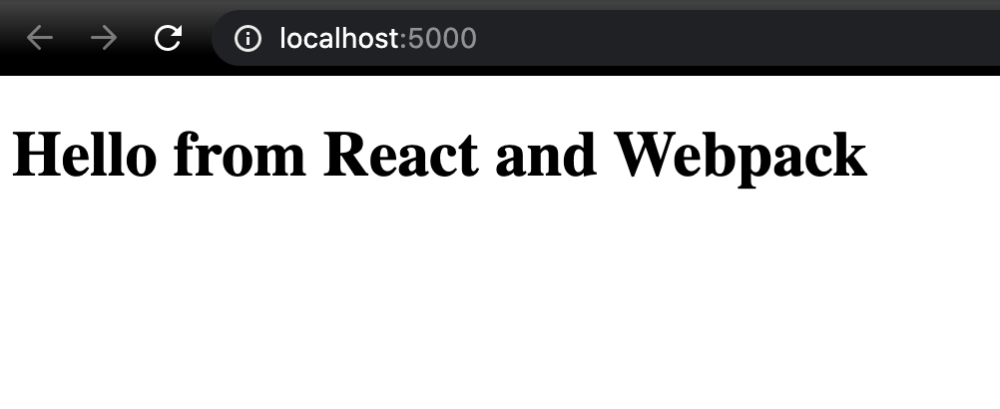

Webpack is a very powerful tool, most modern web development are using webpack to bundle their applications. If you have ever used create react app well that uses webpack behind the scenes to bundle its code, it mostly hides this fact from you unless you eject from it.

Most of the time web developers don't take the time to understand the abstractions or understand what is going on under the hood in some of the tools we use, while most of the time it is not necessary to understand how these tools work (and that is the main point of these tools), there will be points in your journey where you may have to dig deeper. Today I want to help you better understand webpack and show you it is not as complicated as you might think.

## What is webpack

> At its core webpack is a static module bundler for modern JavaScript applications. When webpack processes your application, it internally builds a dependency graph which maps every module your project needs and generates one or more bundles.

Why is webpack Required? - That is a great question and I think the webpack team has done a great job explaining it [here](https://webpack.js.org/concepts/why-webpack/)

Webpack has about 6 core concepts:

- Entry
- Output
- Loaders
- Plugins
- Mode
- Browser Compatibility

We are going to dive into each of these concepts over the next few tutorials as we build out own webpack.config file and by the end of this tutorial we should be able to bundle a Simple React application as I think the best way to understand webpack is to build something.

## Webpack Entry & Output

### Step 1: Create an empty directory with webpack.config.js and a package.json file

Open up your terminal or command file and type the following

```sh
# Make the tutorial directory
mkdir webpack-tut
cd webpack-tut
# Create the webpack.config.js file
touch webpack.config.js
# Generate package.json file
npm init -y
```

### Step 2: Install Webpack and webpack cli

`npm install webpack webpack-cli --save-dev`

- `webpack` - Core library
- `webpack-cli` - allows us to run webpack commands from the command line.

Open that folder in your favorite editor, mine is vscode.

### Step 3: Add an Entry point for Webpack

```js{2}
module.exports = {
  entry: "./src/index.js",
}
```

- `entry` specifies the start point for webpack, this is where it starts to crawl your repository to build a dependency graph to know what it should and shouldn't include in your bundle

### Step 4: Add an Output for Webpack

```js{3-6}
module.exports = {
  entry: "./src/index.js",
  output: {
    path: __dirname + "/public",
    publicPath: "/",
    filename: "bundle.js",
  },
}
```

In step 3 we specified the input for webpack, now we are telling webpack where to output after it has done processing or another way said `output` instructs webpack on how and where it should output your bundles, assets and anything else you bundle with webpack.

- `__dirname` - is the current directory name
- `filename` - will be your bundle name

Believe it or not that is the minimum webpack configuration needed to start bundling js, so lets try it out

### Step 5: Create the entry point file `src/index.js`

Back on the command line run / create a folder and file via explorer

```sh
cd webpack-tut
mkdir src
cd src
touch index.js
```

Open index.js in your editor and add `console.log('Hello webpack')`

### Step 6: Bundle our one file application.

Now that we have our entry point, let add an npm script to create our webpack bundle.

Open package.json, under the script section add `"build": "webpack"`, webpack command comes from webpack-cli and will build out bundle.

```json
{
  "name": "webpack-tut",
  "version": "1.0.0",
  "description": "",
  "main": "webpack.config.js",
  "scripts": {
    "build": "webpack",
    "test": "echo \"Error: no test specified\" && exit 1"
  },
  "keywords": [],
  "author": "",
  "license": "ISC",
  "dependencies": {
    "webpack": "^4.43.0",
    "webpack-cli": "^3.3.11"
  }
}
```

Now open up your terminal once more and run: `npm run build`. You should see webpack run and if you look at your explorer you will have a new folder called public with a new file called `bundle.js`. If you open it and right at the end you will see our Hello world console.

Awesome, we now have webpack building our one line/file application! Not very useful at the moment but we can build on this solid base and we know webpack is working correctly.

## Webpack Loaders and Plugins

Lets take the simple webpack config we built in the last step and add support for react!

### Loaders

Out of the box, webpack only understands JavaScript and JSON files. Loaders allow webpack to process other types of files and convert them into valid modules that can be consumed by your application. React uses `.jsx` files, since webpack can't handle jsx files directly we need to add a loader to support that. Loaders need to be installed because they are separate packages and as stated don't come built into webpack. Lets install the loaders:

### Step 7: Install babel-loader and its dependencies

`npm install @babel/core @babel/preset-react babel-loader --save-dev`

- `babel-loader` is the webpack loader that we will use to transform .jsx files into javascript.
- Babel is a Javascript compiler, it allows us to write Modern + future Javascript without worrying about if a user browser supports it. Babel will compile the code to support older browsers / version of Javascript. Babel is another complicated tool but just know its job is to compile Javascript and this is why it makes a great candidate to compile .jsx files to .js file so the browser can work with them.
- `@babel/core @babel/preset-react` - Core is the main babel library that the loader depends on, @babel/preset-react is a set of default that will help babel compile react applications. There are a whole bunch of babel [presets](https://babeljs.io/docs/en/presets).

### Step 8: Use webpack loader babel-loader to compile jsx files to js

Back to webpack, now that we have installed the necessary packages lets add a loader to convert jsx files into js files, open webpack.config.js:

```js{8-23}
module.exports = {
  entry: "./src/index.js",
  output: {
    path: __dirname + "/public",
    publicPath: "/",
    filename: "bundle.js",
  },
  resolve: {
    extensions: [".jsx", ".js", "json"],
  },
  module: {
    rules: [
      {
        test: /\.jsx?$/,
        loader: require.resolve("babel-loader"),
        exclude: /node_modules/,
        // Options for the plugin
        options: {
          presets: [require.resolve("@babel/preset-react")],
        },
      },
    ],
  },
}
```

We have added `module/rules` section, modules are where loaders are specified. Loaders have two "required" properties, test & use/loader, test is used to identify the files the specific loader should transform, in case above babel-loader should look at jsx files and compile/transform them, it should also use @babel/preset-react for its defaults.

Remember, this may look confusing but lets explain what we did in english: we need to convert jsx files into js files for the browser to understand, webpack only understands js and json files so we need to update how webpack looks for jsx files so we changed the `resolve` property. Now that webpack can find the jsx files we need a loader to compile/transform it to js, that is `babel-loader` job. Once that is done we can install react.

### Step 9: Install react, create a jsx file

`npm install react react-dom`

Create an App.jsx file in src

```jsx
import React from "react"

const App = () => (
  <div>
    <h1>Hello from React and Webpack</h1>
  </div>
)
export default App
```

Modify out `index.js` to mount our react App.

```js
import React from "react"
import ReactDOM from "react-dom"
import App from "./App"

ReactDOM.render(<App />, document.getElementById("root"))
```

If you have used react before you know this line you might say but we don't have a root element to mount to, lets change that.

In `webpack-tut/public` create an index.html file

```html
<!DOCTYPE html>
<html lang="en">
  <title>
    Webpack Tutorial
  </title>
  <body>
    <div id="root"></div>
  </body>
  <script src="main.bundle.js"></script>
</html>
```

We have a div with an id of root so react can mount the application, we also have included our main.bundle.js file.

Lets run webpack one more time `npm run build` to make sure main.bundle.js is up to date with our react code.

If you open your main.bundle.js file you will see it has gotten a lot bigger...well now it is including react and react-dom that is good news for this tutorial! Let see if it works in a browser...

### Step 10: Testing out React application in a browser

We built our application bundle which included react in the last step now we need a way to serve that bundle, the easiest way on our machine is to use an npm package called serve so lets do that. Back at the command line run `npx serve public`

Our assets live in public so we serve will host that folder. Open http://localhost:5000 and...


Cool it works!, you have just created a webpack configuration that supports building react application. You have built a very very small version of create-react-app how awesome is that!.

## Conclusion

Congrats on building a webpack configuration that supports react! I think that is a good place to stop this first post. We learned about 3 of webpack core concepts Entry, Output, Loaders, in the next few tutorials we will look at adding typescript and css support via loaders and making our build a bit more production ready. I hope you enjoyed this post!

Until next time,

Jason
