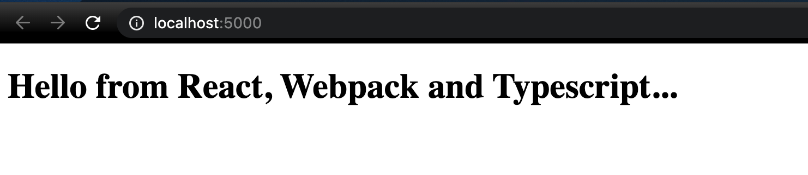
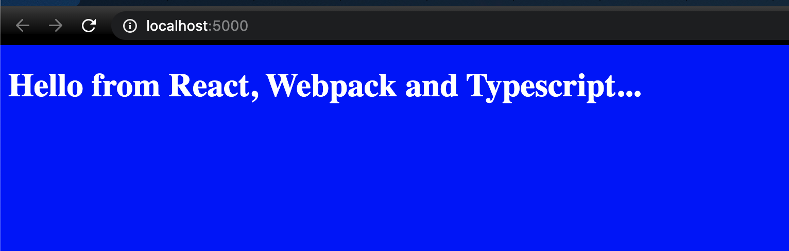
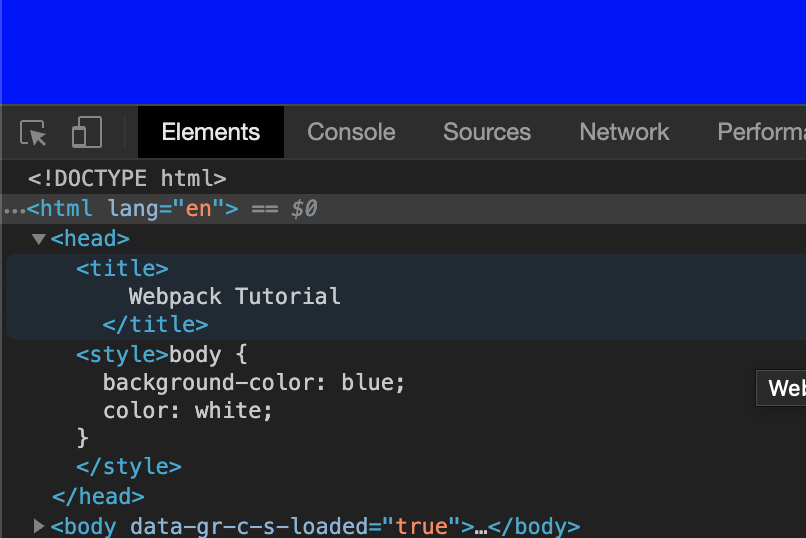

This is part 2 of our webpack tutorial, we are exploring building out our own webpack config file to better understand what some tools like create react app are doing under the hood. Today we are going to be discussing how to add typescript support to our sample application, we are also going to add support for importing css files like CRA does e.g `import './index.css'`

## Adding Typescript support to Webpack

I personally love Typescript, if you don't know what Typescript is your missing out, it is a super-set of JS that adds type safety to your code. If you are not interested in adding Typescript support to your application then you can skip to the next section.

As stated in previous tutorials, webpack only supports js and json files out of the box, in the last tutorial we added support for jsx files in this section of the tutorial we are going to add support for tsx files. Luckily babel-loader can also work with ts / tsx files, so we just need to add a typescript preset to help babel along, we also need to install typescript so open up your command line:

```sh
➜  cd webpack-tut
➜  npm install @babel/preset-typescript typescript --save-dev
```

Open up the webpack.config.js and add support for ts and tsx files:

```js
module.exports = {
  entry: "./src/index",
  output: {
    path: __dirname + "/public",
    publicPath: "/",
    filename: "[name].bundle.js",
  },
  resolve: {
    extensions: [".ts", ".tsx", ".jsx", ".js"],
  },
  module: {
    rules: [
      // Loader has two "required" properties, test & use/loader, test is used to identifer the files the specific loader should transform, in case below babel-loader should look at jsx files.
      {
        test: /\.(js|jsx|ts|tsx)$/,
        loader: require.resolve("babel-loader"),
        exclude: /node_modules/,
        // Options for the plugin
        options: {
          presets: [
            require.resolve("@babel/preset-react"),
            require.resolve("@babel/preset-typescript"),
          ],
        },
      },
    ],
  },
}
```

`extensions` - We have expanded the extensions array to now search for `.ts` and `.tsx` files
`rules/test` - We have updated the test regex to make sure `.ts` and `.tsx` files are picked up by the babel-loader as well as the js and jsx files from last tutorial.
`rules/options/presets` - We have updated the presets to now include the `@babel/preset-typescript`

That should be all that is required to add support for typescript and typescript jsx files, before we try it out we should probably add a tsconfig.json file. When you have a typescript project is is usually a good idea to have a tsconfig.json file. tsconfig.json just tells the typescript compiler what rules / configuration to use when checking the files for type errors. The great thing is, typescript has a cli util to help us with that so open up your command line:

```sh
➜  cd webpack-tut
➜  npx tsc --init
```

`tsc` - Is the typescript compiler, we are using npx so we don't have to install typescript globally.

Once that command is finished you should have a tsconfig.json file in the root of your repo, I am not going to go through each of the settings in there but just know it is good to have this in a typescript project.

Lets try compile our first typescript files, in the last tutorial we created App.jsx and index.js, lets rename them to App.tsx and index.tsx. Lets add some typescript to App.tsx to make sure it compiles:

```tsx
import React from "react"

const App = () => {
  const welcomeMessage: string = "Hello from React, Webpack and Typescript..."

  return (
    <div>
      <h1>{welcomeMessage}</h1>
    </div>
  )
}
export default App
```

We have added the `: string` type to the welcomeMessage - Note: This is kinda redundant since we assign it directly to a string but I just want to sure this is compiling. Now lets run our build command

```sh
➜  npm run build
```

After it runs successful, we can serve the public folder like we did in the last tutorial `npx serve public`, open http://localhost:5000


Excellent we have added support for Typescript, lets move on and add support for css files

## Adding CSS support to Webpack

We want to be able to import css files into our react component files like `import './index.css'`. CRA supports this out of the box so lets add it to our webpack config.

Again, webpack doesn't support CSS out of the box so we will need add loaders to support importing css files. Open your command line and run:

```sh
➜  npm install css-loader style-loader --save-dev
```

Each of these loaders do two separate jobs:

- `css-loader` - Interprets @import and url() like import/require() and will resolve them i.e it will find the css files we reference in our import statements
- `style-loader` - Inject CSS into the DOM - Once we have our styles from the `css-loader` we need another loader to inject them, this is style loaders job.

Lets update webpack to use the new loaders we just installed:

```js
module.exports = {
  entry: "./src/index",
  output: {
    path: __dirname + "/public",
    publicPath: "/",
    filename: "[name].bundle.js",
  },
  resolve: {
    extensions: [".ts", ".tsx", ".jsx", ".js"],
  },
  module: {
    rules: [
      // Loader has two "required" properties, test & use/loader, test is used to identifer the files the specific loader should transform, in case below babel-loader should look at jsx files.
      {
        test: /\.(js|mjs|jsx|ts|tsx)$/,
        loader: require.resolve("babel-loader"),
        exclude: /node_modules/,
        // Options for the plugin
        options: {
          presets: [
            require.resolve("@babel/preset-react"),
            require.resolve("@babel/preset-typescript"),
          ],
        },
      },
      {
        test: /\.css$/,
        use: ["style-loader", "css-loader"],
      },
    ],
  },
}
```

We look for `.css` files via the test pattern and we tell webpack to use the loaders we just installed, `use` is an alternative to loader I just want to show both options incase you see it out there.

Lets try it out by creating a index.css in the root of our repository with one rule to make sure it works:

```css (index.css)
body {
  background-color: blue;
  color: white;
}
```

Now import it in App.tsx

```tsx
import React from "react"
import "./index.css"

const App = () => {
  const welcomeMessage: string = "Hello from React, Webpack and Typescript..."

  return (
    <div>
      <h1>{welcomeMessage}</h1>
    </div>
  )
}
export default App
```

Open the command line and run `npm run build` and `npx serve public`, open http://localhost:5000:


A few notes on `style-loader`, we know it job is to inject css into the dom and if you open your dev tools and look at the header you will see:


This is fine when you have one css file but it is a common pattern to have a css file per component you make, if we only use `style-loader` it will inject all the css into the same style tag. This may not be what you want and this is not what create react app does. CRA will output CSS to its own file during production mode and during development will inject css into head of the document like style-loader. CRA uses another loader MiniCssExtractPlugin instead of `style-loader` to put CSS into separate files. It creates a CSS file per JS file which contains CSS. It supports On-Demand-Loading of CSS and SourceMaps. MiniCssExtractPlugin also allow us to hot reload css during development which I will discuss later in the Better Development workflow section.

Since we are building out our own little version of CRA lets do that as well:

```sh
➜  npm install mini-css-extract-plugin --save-dev
# Remove the style-loader as we not longer need it
➜  npm remove style-loader
```

Now update webpack.config.js to now use MiniCssExtractPlugin loader and plugin:

```js
const MiniCssExtractPlugin = require("mini-css-extract-plugin")

module.exports = {
  entry: "./src/index",
  output: {
    path: __dirname + "/public",
    publicPath: "/",
    filename: "[name].bundle.js",
  },
  resolve: {
    extensions: [".ts", ".tsx", ".jsx", ".js"],
  },
  module: {
    rules: [
      {
        test: /\.(js|mjs|jsx|ts|tsx)$/,
        loader: require.resolve("babel-loader"),
        exclude: /node_modules/,
        // Options for the plugin
        options: {
          presets: [
            require.resolve("@babel/preset-react"),
            require.resolve("@babel/preset-typescript"),
          ],
        },
      },
      {
        test: /\.css$/,
        use: [MiniCssExtractPlugin.loader, "css-loader"],
      },
    ],
  },
}
```

We have replaced `style-loader` with MiniCssExtractPlugin.loader. Open the command line and run `npm run build` you will see a new main.css file after the build as completed, lets update index.html to include the newly generated css file

```html
<!DOCTYPE html>
<html lang="en">
  <title>
    Webpack Tutorial
  </title>
  <head>
    <link rel="stylesheet" href="main.css" />
  </head>
  <body>
    <div id="root"></div>
  </body>
  <script src="main.bundle.js"></script>
  <script src="randomJslib.js"></script>
</html>
```

px serve public`, open http://localhost:5000 and we are still working!. It may seem like we did a lot of work to acheive the same result but in the next section when we enable hot reloading of our dev environment you will see even more why we did it.

## Better development workflow

// Constantly running npm run build is annoying, constantly serving it is annoying so lets fix that by using webpack-dev-server.
// dev-server intro, configuration and use,

## Conclusion

// Blah
