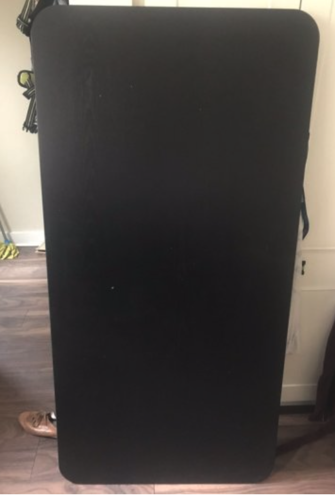
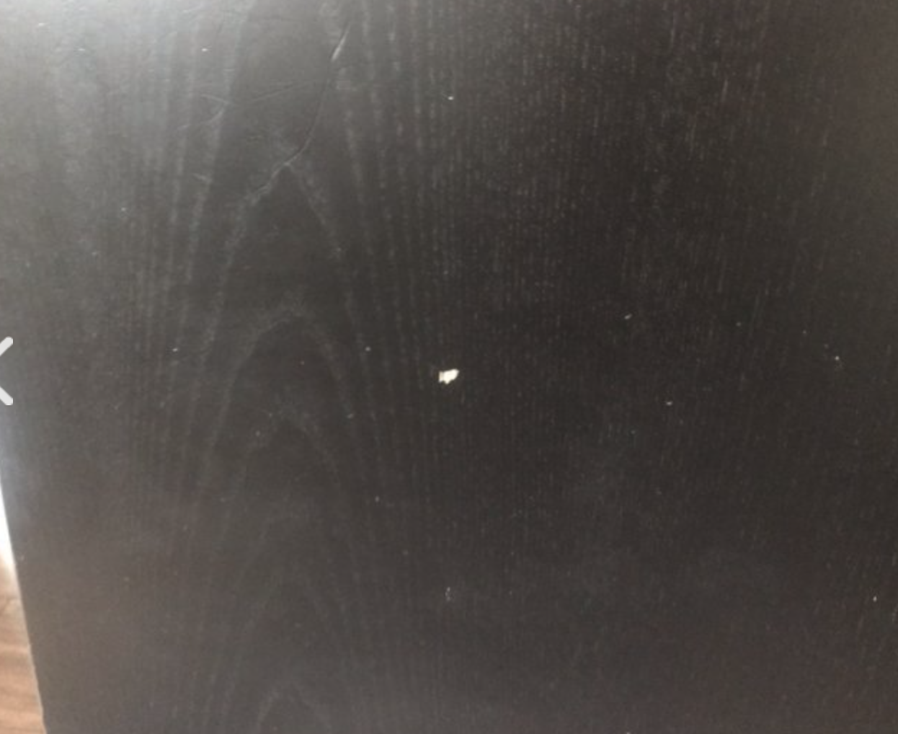
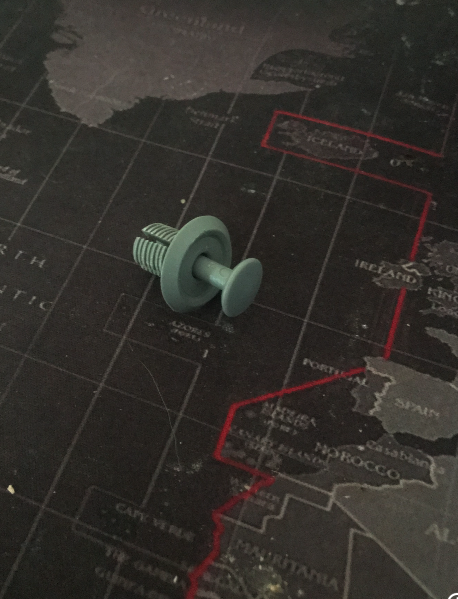

Today post is a bit different, about 3 years ago I bought an Ikea Standing Desk the post about it can be seen [here](https://thedeployguy.com/2017-03-19-standing-desks-bekant-ikea-review/), I want to do a very quick long term review 3 years later and I want to discuss a better alternative / tabletop if you are going to buy this desk.

## Ikea Standing Desk Long Term Review

This desk is great, every part of it has held up and it is still mostly in perfect condition, I have never had a problem with the motors in the legs and it has never failed to go into standing mode. The one part which ended up having a lot of issues was the table top. I got the Bekant Black Table Top you can see it in my old post and here is a picture from about 1 month ago:

It doesn't look too bad from a distance but a closer picture you can see:

Little chips of wood started to appear over the last year or so it was coming to its end of life. 3 Years is not a bad lifetime for a tabletop but I would expect it to last a bit longer. This is why I was on the outlook for a replacement and I found what I think is the perfect Ikea Standing Desk setup.

## The Perfect Desk

Since my Black table top started to come apart it was time I either look for an alternative desk or another tabletop. As I was looking around for inspiration I found this combination of [IKEA Karlby Countertop and Alex Drawers](https://desktopgoals.com/ikea-karlby-and-alex/). I loved the tabletop and the drawers but I also wanted to keep my standing desk, I started looking at if the tabletop could be retrofitted onto the IKEA standing desk legs and I found out it could!

I went online bought the smallest [Karlby counter top](https://www.ikea.com/ie/en/p/karlby-worktop-walnut-veneer-30335191/) which was 186x38 cm, the Bekant tabletop size is 160x80 cm, so the Karlby counter top is longer but less wider than the Bekant tabletop. The only worry I had was that the Karlby countertop was a not wider enough, IKEA standing desk legs have supports under the center of the desk that supports the center of the desk and they are very wide...luckily enough the Karlby width is just perfect to hide the center supports.

The next question I had was how I was going to secure the Karlby counter top to the Standing legs, I could screw it with wood screws but I wanted to be able to take it apart quickly (My office is also the guest bedroom so it needs to moved from timed to time). IKEA Bekant Tabletop with the legs came with this types of "screws":

You can put the "screw" into the holder it expands the holder to keep the desk in place, the part I love about this is it can be easily removed! So I measured the holes for the screws, drilled the holes and tested out the screws. Once everything was done it was time to assemble the whole thing, the finish product looked like:

This is what it looks like in sitting mode:

I have been using it for about 2 months now and I loved it, if I was buying this whole setup again I would directly buy the Karlby Countertop with the legs and I would have never bought the iKEA black tabletop.

## Conclusion

I loved my new desk I hope this will you give some ideas for your own desktop setup. I hope you enjoyed this different type of post on my desk setup.

Until next time,

Jason
