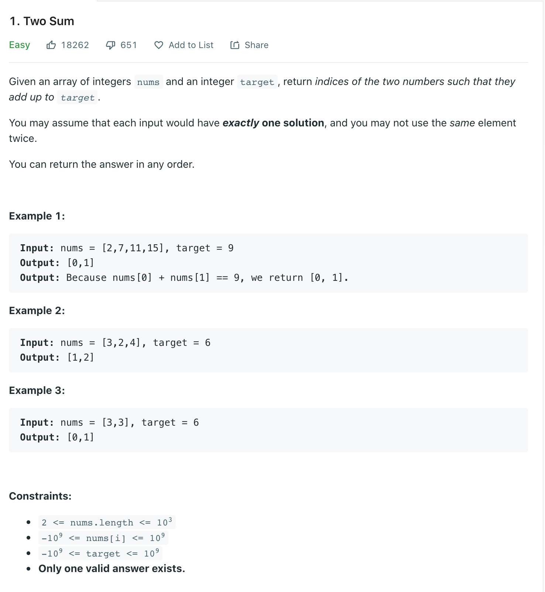
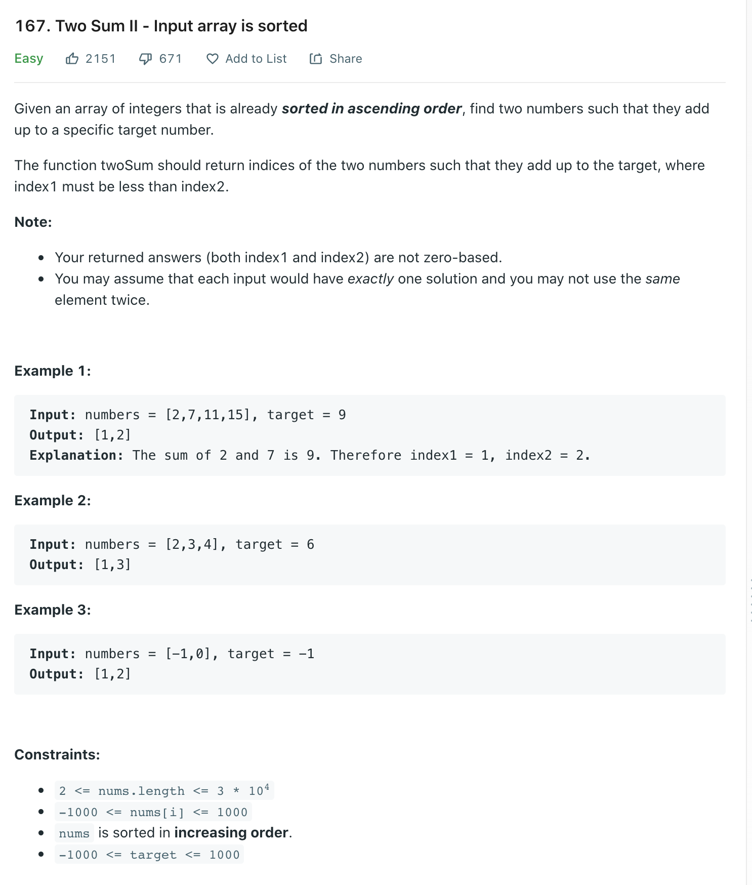

Welcome back, one of my Self Development Goals for 2021 is "Complete at least 25 - 50 Leetcode Questions" so why not get this goal started right away. Leetcode has a huge question bank of questions so what questions have I decided to answer? Looking around online there seems to be different opinions on what do focus on and whilst there is no definitive answer some good advice I found is to generally look at different areas / Techniques e.g: Arrays, Dynamic Programming, Binary Search, Graphs (DFS, BFS), Trie etc. The first area I have decided to focus on is Arrays / Two pointers as they seem to closely related in a lot of problems.

## Two Sum Problem



[Link](https://leetcode.com/problems/two-sum/)

## Two Sum Solution

There are a few ways to approach this problem we could Bruce force the solution by having two loops, for each number in list check against rest of numbers to see if matches the target. This solution would work but its time complexity is O(n^2), can we do better?

We can, we can use additional space to reduce the overall time complexity. The idea is: as we go through each number, check if target - currentNum already exist in hashmap(meaning it exists in the array) we can return that value & index as well as the current index. If we cannot find the value in the array we can add it along with the index (hash_map[num] = i).

```py
class Solution(object):
    def twoSum(self, nums, target):
        """
        :type nums: List[int]
        :type target: int
        :rtype: List[int]
        """
        hash_map = {};
        # Go through each element, minus that element from the target, if that new target exists return hash_map[new_target], currentIndex, if its not in the hashmap add it (Key = Number), value = index
        for i, num in enumerate(nums):
            n = target - num
            if n in hash_map:
                return [hash_map[n], i]
            else:
                hash_map[num] = i;

# Input: nums = [2,7,11,15], target = 9
# Output: [0,1]
#  Output: Because nums[0] + nums[1] == 9, we return [0, 1].

```

### Time / Space Complexity

Time: O(n)
Why: At worst we need go through each element of the array to find two matching elements, hash table look ups are O(1) so our complexity is O(n)

Space: O(n)
Why: As we are using a hash table to store every each element of the array (to check if can find target - currentNum is in Hashmap) the space is O(n) because at worst we have to store every element.

Could we solve this using constant space? O(1) i.e No other data structures the answer is yes! and I will show you that by answering another leet code question Two Sum II. Both problems can solved using a hashmap but they both can also be solved via another way which will give us O(1) space.

## Two Sum II Problem



[Link](https://leetcode.com/problems/two-sum-ii-input-array-is-sorted/)

## Two Sum II Solution

A very important part of the problem statement "already sorted in ascending order" because of this we know smaller values are on the left of array and bigger values are on the right. We can approach a solution like so:

- Place a pointer at the start and the end of the array
- While the left and right pointer are not in the same place
- Check if numbers[leftPointer] + numbers[rightPointer] = target
- If the numbers[leftPointer] + numbers[rightPointer] > target we know we need a smaller value so we can "shift" the right pointer to the left. As array is sorted values lesser than our current value are on the left
- If the numbers[leftPointer] + numbers[rightPointer] < target we know we need a bigger value so we can "shift" the left pointer to the pointer. As array is sorted values bigger than our current value are on the right
- If we find the target return the indexes of left and right pointer + 1.

This approach is know as a Two pointer solution, it is a very useful technique and it is used quite a lot in array problems.

```py
class Solution(object):
    def twoSum(self, numbers, target):
        """
        :type numbers: List[int]
        :type target: int
        :rtype: List[int]

        [2, 7, 11, 15]
         ^         ^

        Time Complexity: O(N)
        Space Complexity: O(1)
        """

        l = 0
        r = len(numbers) - 1

        while l < r:
            # 15 + 2 = 17 > 9
            # 11 + 2 = 13 > 9
            # 7 + 2 = 9 return [0, 1]
            targetVal = numbers[l] + numbers[r]
            if targetVal == target:
                return [l+1, r+1]
            elif targetVal > target:
                r = r -1
            elif targetVal < target:
                l = l + 1

        # Not strictly required as "You may assume that each input would have exactly one solution" just good practice
        return [-1, -1]
```

### Time / Space Complexity

Time: O(n)

Why: At worst we need go through each element of the array to find two matching elements, hash table look ups are O(1) so our complexity is O(n)

Space: O(1)

Why: Previously we were using a hashmap which at worst we would have had to store N elements so space was O(n). Now that we not longer need the hashmap and we are just using pointers the space becomes O(1)

## Conclusion

I hope you enjoyed this first post on solving Leetcode problems, there are a lot of articles / videos explaining this problem, I feel like sometimes these skip over important details which is another reason why I wanted to write about them. Anyway, that is 2 / 25 for my yearly goal done! now onto the rest, i hope you enjoyed this post!

Until next time

Jason
