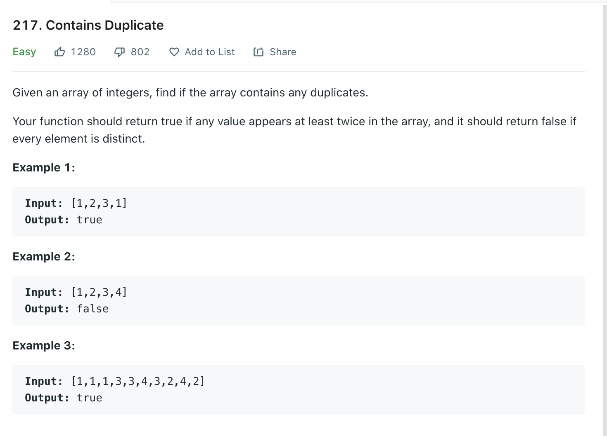

Welcome back, part of my Self Development Goals for 2021 is "Complete at least 25 - 50 Leetcode Questions", today we are going to discuss and solve [Leetcode 217 Contains Duplicate](https://leetcode.com/problems/contains-duplicate/)

## Contains Duplicate Problem



## Contains Duplicate Solution

As with every leetcode problem there are various ways to solve this, we could always brute force with a double for loop checking each number but that would give us a O(n^2) time complexity. Can we do better? Of course we can, we need to find out if the current number we are on has already been seen, if it has return True. How can we keep track of values we have seen so far and how can we lookup them values efficiently?...We could use a Hashmap / Dict to store every number we see, a hashmap also provides an O(1) lookup which is instant. So plan is:

\# Pseudocode

```
create hashmap to store values seen
    Loop through every number in list
        if currentNum is in hashmap we have found duplicate so return true
        else currentNum is not in hashmap store the number has the key in the 5. hashmap and the value can be anything

If we get to the end of the loop without returning we know the list has no duplicates so return false.

```

```py
class Solution:
    def containsDuplicate(self, nums: List[int]) -> bool:
        """
        :type nums: List[int]
        :rtype: bool
        """
        num_dict = {}

        for num in nums:
            if num in num_dict:
                return True
            else:
                num_dict[num] = num

        return False
```

### Time / Space Complexity

Time: O(n)

Why: At worst we need go through each element of the array to find a duplicate element, hash table look ups are O(1) so our complexity is O(n)

Space: O(n)

Why: As we are using a hash table to store every each element of the array the space is O(n) because at worst we have to store every element (if there were no duplicates)

## Conclusion

I hope you enjoyed this second post on solving some Leetcode problems, Anyway, that is 3 / 25 for my yearly goal done! now onto the rest, i hope you enjoyed this post!

Until next time

Jason
