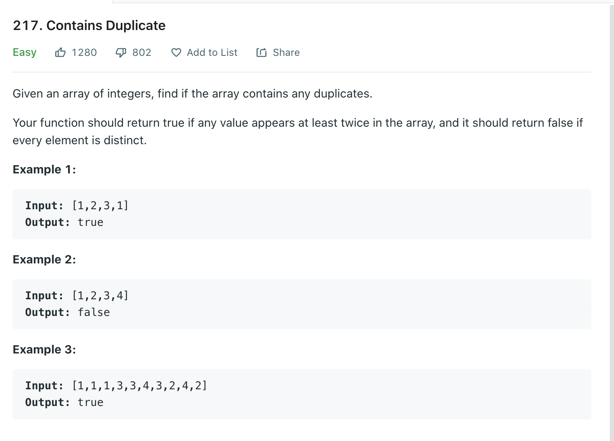

Welcome back, part of my Self Development Goals for 2021 is "Complete at least 25 - 50 Leetcode Questions", today we are going to discuss Leetcode 217 Contains Duplicate.

## Contains Duplicate Problem



[Link](https://leetcode.com/problems/contains-duplicate/)

## Contains Duplicate Solution

```py
class Solution(object):
    def containsDuplicate(self, nums):
        """
        :type nums: List[int]
        :rtype: bool
        """
        num_dict = {}

        for num in nums:
            if num in num_dict:
                return True
            else:
                num_dict[num] = num

        return False
```

### Time / Space Complexity

Time: O(n)
Why: At worst we need go through each element of the array to find two matching elements, hash table look ups are O(1) so our complexity is O(n)

Space: O(n)
Why: As we are using a hash table to store every each element of the array (to check if can find target - currentNum is in Hashmap) the space is O(n) because at worst we have to store every element.

Could we solve this using constant space? O(1) i.e No other data structures the answer is yes! and I will show you that by answering another leet code question Two Sum II. Both problems can solved using a hashmap but they both can also be solved via another way which will give us O(1) space.

## Conclusion

I hope you enjoyed this first post on solving some Leetcode problems, there are a lot of articles / videos explaining this problem, I feel like sometimes these skip over important details which is another reason why I wanted to write about them. Anyway, that is 2 / 25 for my yearly goal done! now onto the rest, i hope you enjoyed this post!

Until next time

Jason
