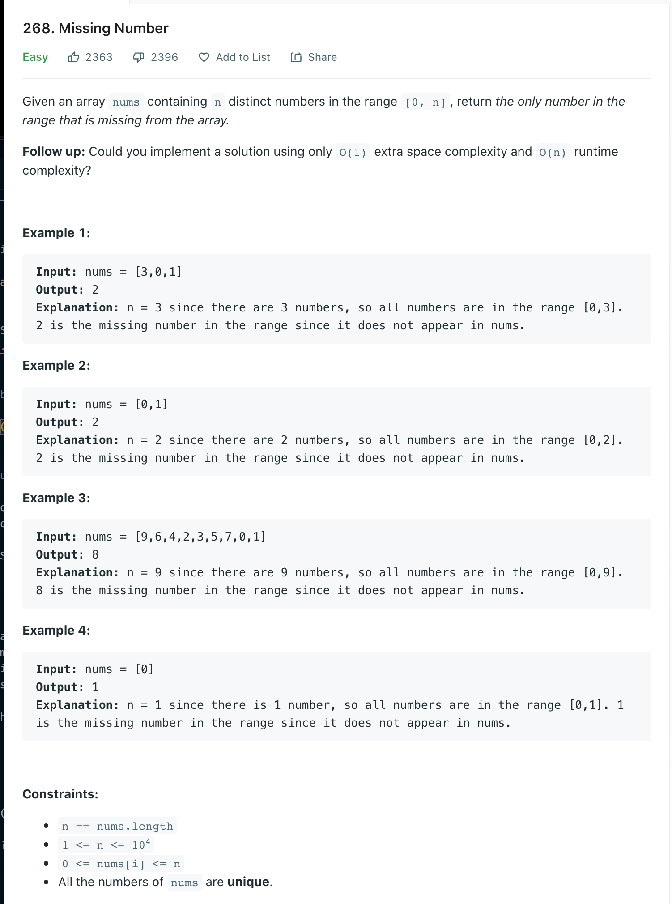

Welcome back, part of my Self Development Goals for 2021 is "Complete at least 25 - 50 Leetcode Questions", today we are going to discuss and solve [Leetcode 268 Missing Numbers](https://leetcode.com/problems/missing-number)

## Missing Number Problem



## Missing Number Solution 1

As with every leetcode problem there are various ways to solve this, we will be discussing two ways of solving this problem. Firstly we will solve it with O(n) time and space complexity then we will see if we can improve it by using no extra space i.e solving it in O(1) space.

\# Pseudocode

```
    1. Create a set with the current unique numbers in the array
    2. Go through each number from 0...n+1
    3. If number not in set then return it
```

```py
class Solution:
    def missingNumber(self, nums: List[int]) -> int:
        """
        :type nums: List[int]
        :rtype: int
        """

        num_set = set(nums)

        n = len(nums) + 1
        for number in range(n):
            if number not in num_set:
                return number

```

### Time / Space Complexity

Time: O(n + n) = O(n): O(Cost of creating set + cost of loop), Set/Hashmap lookup is O(1)

Why: At worst we need go through each element of the array to find a duplicate element, hash table look ups are O(1) so our complexity is O(n)

Space: O(n)

Why: As we are using a set to store every each element of the array the space is O(n) because at worst we have to store every element.

## Missing Number Solution 2

Lets improve our space from O(n) to O(1), we know our array is meant to contain from 0...n, what if we added up all the numbers that are suppose to be in the array and compared that to what we actual have in the array...we find the missing number! e.g Lets say we have [3, 0, 1] so the total of current array is 3 + 0 + 1 = 4, the sum of the indexes are 0 + 1 + 2 + 3(len(n)) = 6, 6 - 4 = 2 the missing number!

```py
class Solution:
   def missingNumber(self, nums: List[int]) -> int:
       """
       :type nums: List[int]
       :rtype: int

       O(1) solution

       Solution: Add up numbers in array, add up indexes of array
       Sum of indexes - Sum of numbers = Missing number

       [3, 0, 1]
        0. 1  2
       sumWithIndex = 3 + 0 + 1 + 2 = 6
       actualCursum = 0 + 3 + 0 + 1 = 4
       sumWithIndex - actualCursum = 2

       """

       # Start sumWithIndex on length of array because its everything in array + last index as its from 0..N
       sumWithIndex = len(nums)
       actualCurSum = 0;


       for i, num in enumerate(nums):
           sumWithIndex = sumWithIndex + i
           actualCurSum = actualCurSum + num

       return sumWithIndex - actualCurSum
```

### Time / Space Complexity

Time: O(n)

Why: At worst we need go through each element of the array to find a duplicate element, hash table look ups are O(1) so our complexity is O(n)

Space: O(1)

Why: We are no longer using extra space since we are using counters now so its O(1)

## Conclusion

I hope you enjoyed this second post on solving some Leetcode problems, Anyway, that is 4 / 25 for my yearly goal done! now onto the rest, i hope you enjoyed this post!

Until next time

Jason
