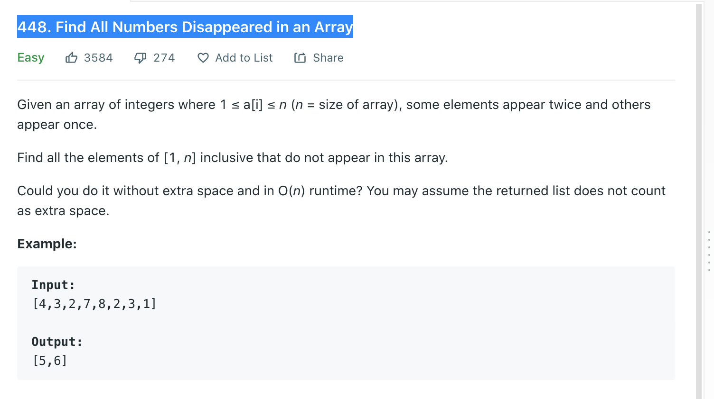

Welcome back, part of my Self Development Goals for 2021 is "Complete at least 25 - 50 Leetcode Questions", today we are going to discuss and solve [Leetcode Leetcode 448 Find All Numbers Disappeared in an Array](https://leetcode.com/problems/find-all-numbers-disappeared-in-an-array)

## Find All Numbers Disappeared in an Array Problem



## Find All Numbers Disappeared in an Array Solution 1

As with every leetcode problem there are various ways to solve this, I have added 3 different solutions into the comments with different time and space complexities. The solution I will go into detail will run in O(n) time and O(1) space but any of the solutions would pass in leetcode.

\# Pseudocode

```
        for all numbers in array
            Each number is treated as index (-1)
            Mark that "index" in the array as "seen" (add a -)
        Any positive indexes left will be numbers missing
```

```py
class Solution:
    def findDisappearedNumbers(self, nums: List[int]) -> List[int]:
        # Alternative Solution 1:
        #   Generate hashmap of 1..n
        #   Mark each number in hashmap as "seen"
        #   Find values in hashmap that are 0 and return it
        # Time Complexity: O(n)
        # Space Complexity: O(n)

        # Alternative Solution 2:
        #   Sort list O(n log n)
        #   check index + 1 = cur if not then it missing
        # Time Complexity: O(n log n)
        # Space Complexity: O(n)

        for i, num in enumerate(nums):
            # real index num - 1
            rIndex = abs(num) - 1
            # Take the value at that index and make it negative
            nums[rIndex] = abs(nums[rIndex]) * -1

        return_list = []
        # Any numbers that are positive add index + 1 them return list
        for i,num in enumerate(nums):
            if num > 0:
                return_list.append(i + 1)

        return return_list
```

### Time / Space Complexity

Time: O(n)

Why: We need to go through each number and mark it as "seen", then go through each number again to find any positive numbers.

Space: O(1)

Why: We are modifying the existing array so we are not using any extra space.

## Conclusion

I hope you enjoyed this second post on solving some Leetcode problems, Anyway, that is 5 / 25 for my yearly goal done! now onto the rest, i hope you enjoyed this post!

Until next time

Jason
