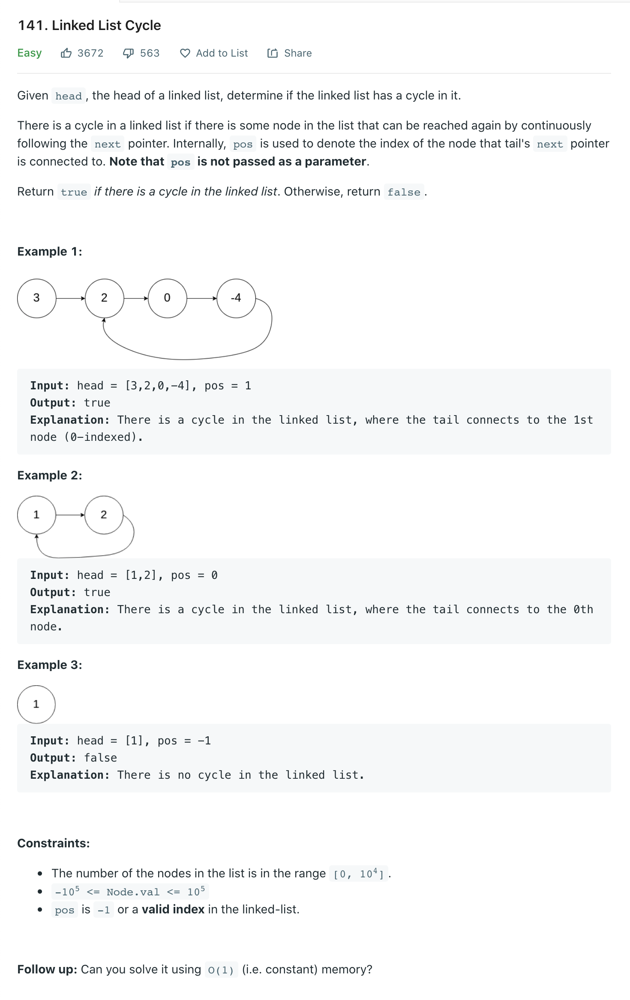

Welcome back, part of my Self Development Goals for 2021 is "Complete at least 25 - 50 Leetcode Questions", today we are going to discuss and solve [Leetcode Linked List Cycle](https://leetcode.com/problems/linked-list-cycle/)

## Problem



## Solution

There are two mains ways to approach this, one using extra space O(n) and a better solution using constant space O(1). We could use a hashmap to store each value then has we go through each value check if its already in the hashmap if it is it contains a cycle. This uses extra space so can we do better? Yes we can we can use two pointers!, if you have followed this leetcode series so far we know we have seen this two pointer technique before so lets discuss it.

```py
# Definition for singly-linked list.
# class ListNode:
#     def __init__(self, x):
#         self.val = x
#         self.next = None

class Solution:
    def hasCycle(self, head: ListNode) -> bool:
        """
        :type head: ListNode
        :rtype: bool

        O(N + K) (full length + time to catchup with slow) = O(N)
        O(1) space since we are using pointers

        Alternative O(n) space is to add each node(memory add) to hashmap, if it we have seen that node before return true, if we get to end of list return false.
        """
        if head is None:
            return False

        slow = head
        fast = head.next

        # While they are not overlapping
        while slow != fast:
            # Fast or fast.next could be null in a list without a cycle
            if fast == None or fast.next == None:
                return False

            slow = slow.next
            fast = fast.next.next

        # The pointers have overlapped return True there is a cycle
        return True

```

## Time / Space Complexity

## Conclusion

I hope you enjoyed this second post on solving some Leetcode problems, Anyway, that is 6 / 25 for my yearly goal done! now onto the rest, i hope you enjoyed this post!

Until next time

Jason
