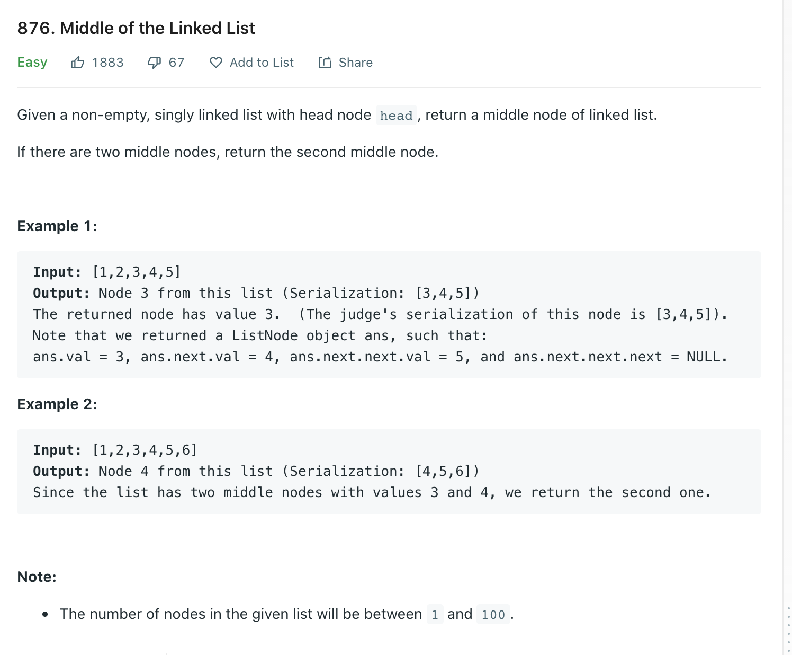

Welcome back, part of my Self Development Goals for 2021 is "Complete at least 25 - 50 Leetcode Questions", today we are going to discuss and solve [Middle of the Linked List](https://leetcode.com/problems/middle-of-the-linked-list/)

## Problem



## Solution

There are two mains ways to approach this, one using extra space O(n) and a better solution using constant space O(1). We could use a array to store each value then has we go through each node then at end take the middle node arr[len(arr) / 2]. This uses extra space so can we do better? Yes we can we can use two pointers!, if you have followed this leetcode series so far we know we have seen this two pointer technique before so lets discuss it.

We will use a fast and a slow pointer, slow an fast will start at the head, for every step the slow pointer takes, fast will take two, since fast transverses twice as fast as slow when fast reaches the end of the list slow will be around the middle. Our logic will be simple while fast is not None/null move the pointers, when fast or fast.next gets to null we have slow should be pointing to middle of list so return slow.

```py
# Definition for singly-linked list.
# class ListNode:
#     def __init__(self, val=0, next=None):
#         self.val = val
#         self.next = next
class Solution:
    def middleNode(self, head: ListNode) -> ListNode:
        """
        :type head: ListNode
        :rtype: ListNode
        """
        # They start on same one because we want to return 2nd middle value incase there are two.
        slow = fast = head

        # If fast is null or fast.next is null we know we reached end of list
        while fast and fast.next:
            slow = slow.next;
            fast = fast.next.next

        return slow
```

## Time / Space Complexity

Time: O(N) = O(N)

Why: We need go through each element of the linked list (until we get to a None/Null pointer).

Space: O(1)

Why: Since we are using only two pointers and not storing the values of a linked list in anything else our space is a constant O(1).

## Conclusion

I hope you enjoyed this second post on solving some Leetcode problems, Anyway, that is 7 / 25 for my yearly goal done! now onto the rest, i hope you enjoyed this post!

Until next time

Jason
