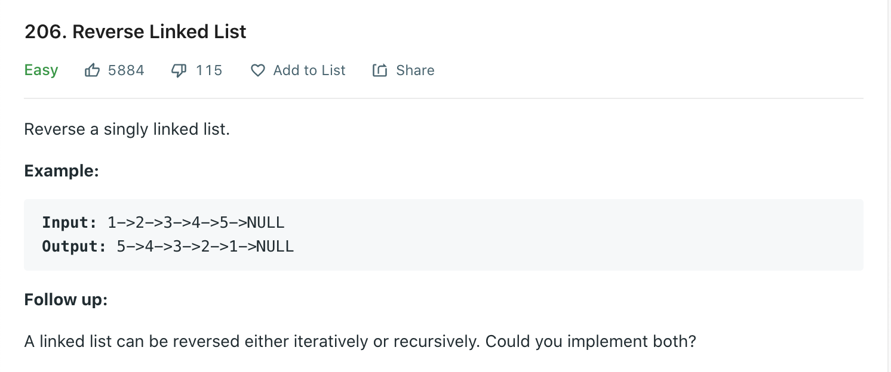

Welcome back, part of my Self Development Goals for 2021 is "Complete at least 25 - 50 Leetcode Questions", today we are going to discuss and solve [Reverse Linked List](https://leetcode.com/problems/reverse-linked-list/)

## Problem



## Solution

The solution while rather simple can be hard to get your head around because it involves moving "pointers". The idea is we reverse in place by storing a temporary reference to the next node, then pointing the next node at the prev value, setting prev to current and setting next to temporary next node. Keep doing this until we reach the end of the list. This results in a linked list that is reversed. The new head of the list will be the last "prev" node so we can return that.

```py
# Definition for singly-linked list.
# class ListNode:
#     def __init__(self, val=0, next=None):
#         self.val = val
#         self.next = next
class Solution:
    def reverseList(self, head: ListNode) -> ListNode:

        prev = None
        current = head
        """
            1->2->3->4->5->NULL
            NULL<-1<-2<-3<-4<-5

        """
        while current != None:
            nextNode = current.next
            current.next = prev
            prev = current
            current = nextNode

        return prev
```

## Time / Space Complexity

Time: O(N)

Why: We need go through each element of the linked list and reverse it

Space: O(1)

Why: Since we are switching pointers in place we are using constant space

## Conclusion

I hope you enjoyed this second post on solving some Leetcode problems, Anyway, that is 8 / 25 for my yearly goal done! now onto the rest, i hope you enjoyed this post!

Until next time

Jason
