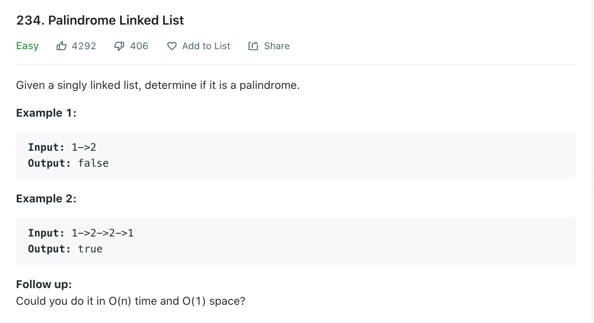

Welcome back, part of my Self Development Goals for 2021 is "Complete at least 25 - 50 Leetcode Questions", today we are going to discuss and solve [Palindrome Linked List](https://leetcode.com/problems/palindrome-linked-list/)

## Problem



## Solution

<!-- TODO -->

```py
# Definition for singly-linked list.
# class ListNode:
#     def __init__(self, val=0, next=None):
#         self.val = val
#         self.next = next
class Solution:
    def isPalindromeExtraSpace(self, head: ListNode) -> bool:
        """
        :type head: ListNode
        :rtype: bool

        Traverse each node in linked list, add value to array.

        Go through array using two pointers, if at any point they are not the same return false, if we make it to end of list return True

        Complexity: O(n + m) = O(n)
        Space: O(n) - Array


        O(1) space?
        """

        arr = []

        while head != None:
            arr.append(head.val)
            head = head.next

        l = 0
        r = len(arr) - 1;

        while l < r:
            if arr[l] != arr[r]:
                return False
            l = l + 1;
            r = r -1;
        return True

    def isPalindrome(self, head: ListNode) -> bool:

        if head == None:
            return True

        slow = fast = head


        # Find middle of list
        while fast and fast.next:
            slow = slow.next
            fast = fast.next.next


        # Repoint fast to head
        fast = head
        # Reverse from slow to end
        slow = self.reverse(slow)

        # Since we have reversed the 2nd part of the linked list, we can now go through each node and compare slow and fast values, fast will point to start -> middle, slow will point from middle to end (reversed)

        while slow != None:
            if slow.val != fast.val:
                return False

            slow = slow.next
            fast = fast.next

        return True


    def reverse(self, currentNode: ListNode):
        prev = None
        while currentNode != None:
            nextNode = currentNode.next
            currentNode.next = prev
            prev = currentNode
            currentNode = nextNode

        return prev

```

## Time / Space Complexity

Time: O(N)

Why: We need go through each element of the linked list and reverse it

Space: O(1)

Why: Since we are switching pointers in place we are using constant space

## Conclusion

I hope you enjoyed this second post on solving some Leetcode problems, Anyway, that is 9 / 25 for my yearly goal done! now onto the rest, i hope you enjoyed this post!

Until next time

Jason
