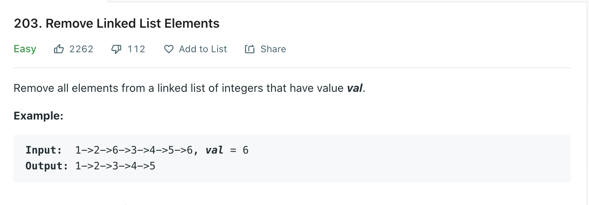

Welcome back, part of my Self Development Goals for 2021 is "Complete at least 25 - 50 Leetcode Questions", today we are going to discuss and solve [Remove Linked List Element](https://leetcode.com/problems/remove-linked-list-elements/)

## Problem



## Solution

```py
# Definition for singly-linked list.
# class ListNode:
#     def __init__(self, val=0, next=None):
#         self.val = val
#         self.next = next
class Solution:
    def removeElements(self, head: ListNode, val: int) -> ListNode:
        """
        :type head: ListNode
        :type val: int
        :rtype: ListNode
        """


        """
        Time Complexity: O(n)
        Space Complexity: O(1) since we reuse existing list.
        """
        if head == None:
            return None

        # Creating Dummy avoid edge cases where 1st node is one that we have to remove, instead we just create a dummy node and append the list to it.
        dummy = ListNode()
        dummy.next = head
        # Keep a pointer to head of list so we can return it
        head = dummy

        while dummy.next != None:
            if dummy.next.val == val:
                dummy.next = dummy.next.next
            else:
                dummy = dummy.next

        return head.next
```

## Time / Space Complexity

Time: O(N + N) = O(N)

Why: We need go through each element of the linked list and add it to an array then go through each element of the new array again to check if its a palindrome so its O(n + n) which is O(n)

Space: O(N)

Why: We are storing each value in an array so the space is O(N)

## Conclusion

I hope you enjoyed this second post on solving some Leetcode problems, Anyway, that is 10 / 25 for my yearly goal done! now onto the rest, i hope you enjoyed this post!

Until next time

Jason
