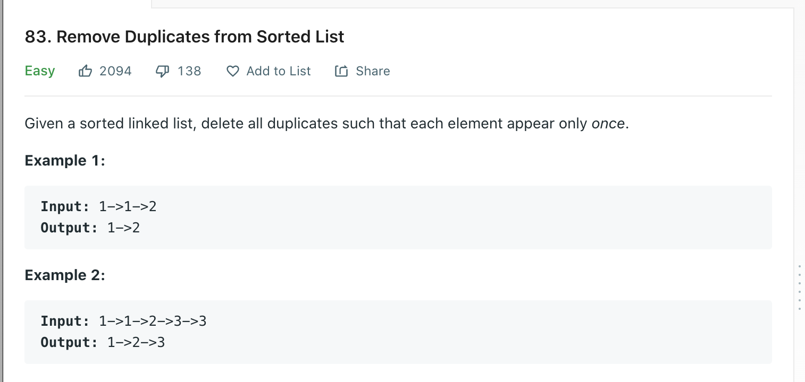

Welcome back, part of my Self Development Goals for 2021 is "Complete at least 25 - 50 Leetcode Questions", today we are going to discuss and solve [Remove Duplicates from Sorted List](https://leetcode.com/problems/remove-duplicates-from-sorted-list/)

## Problem



## Solution

To solve this we could append each of the nodes that don't match the val to another list and then return that list as the new list and that would work. However, can we solve this without using an another list / extra space?

The idea will be, transverse the linked list check if .next.val === valToRemove, if it does change .next = .next.next (thereby deleting the node in-between). If it doesn't match the value we can advance the current pointer by one.

There is a subtle edge case you need to watch out for which is when the first node is the node to delete, you could add a bunch of extra if statements to check for this edge case or else you can just use a "dummy node". Dummy nodes are common in linked list problems when you need to remove elements, the idea is the new head of the list will be the dummy node(head = dummy), while the dummy.next != null transverse the list checking if we need to remove the node. When we are at the end of the list we return the list without the dummy element which would be head.next (since head points at dummy)

```py
# Definition for singly-linked list.
# class ListNode:
#     def __init__(self, val=0, next=None):
#         self.val = val
#         self.next = next
class Solution:
    def removeElements(self, head: ListNode, val: int) -> ListNode:
        """
        Time Complexity: O(n)
        Space Complexity: O(1) since we reuse existing list.
        """
        if head == None:
            return None

        # Creating Dummy avoid edge cases where 1st node is one that we have to remove, instead we just create a dummy node and append the list to it.
        dummy = ListNode()
        dummy.next = head
        # Keep a pointer to head of list so we can return it
        head = dummy

        while dummy.next != None:
            if dummy.next.val == val:
                dummy.next = dummy.next.next
            else:
                dummy = dummy.next

        return head.next
```

## Time / Space Complexity

Time: O(N)

Why: We need to transverse the entire linked list in order to remove every element that matches the value.

Space: O(1)

Why: We are just switching pointers to remove elements so its constant space.

## Conclusion

I hope you enjoyed this second post on solving some Leetcode problems, Anyway, that is 10 / 25 for my yearly goal done! now onto the rest, i hope you enjoyed this post!

Until next time

Jason
