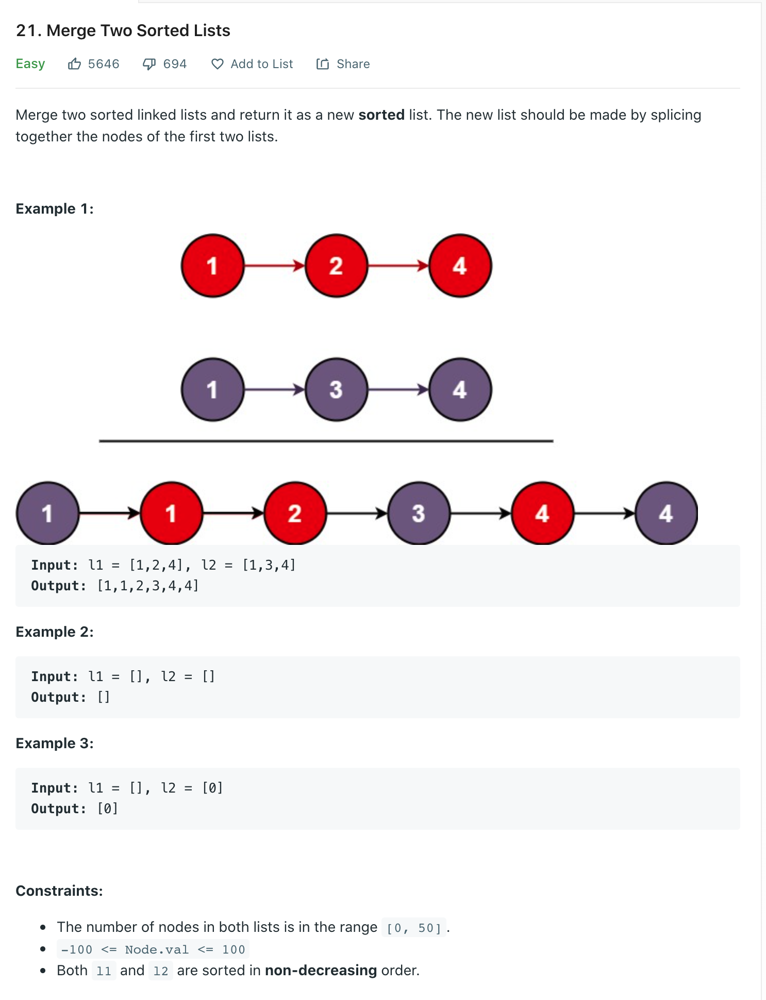

Welcome back, part of my Self Development Goals for 2021 is "Complete at least 25 - 50 Leetcode Questions", today we are going to discuss and solve [Merge Two Sorted Lists](https://leetcode.com/problems/merge-two-sorted-lists/)

## Problem



## Solution

Since the lists are sorted, we could look at both lists, compare the numbers take the lesser value and append it to a new list, we keep doing this until one of the lists is empty then we merge anything left over.

This is another problem that can be solved using two pointers, we will also create a dummy node to avoid any edge cases and allows us to keep a pointer to the head of the list. I have added comments to the code detailing each step:

```py
# Definition for singly-linked list.
# class ListNode:
#     def __init__(self, val=0, next=None):
#         self.val = val
#         self.next = next
class Solution:
    def mergeTwoLists(self, l1: ListNode, l2: ListNode) -> ListNode:
        # Create dummy node / pointer
        newMergedLL = ListNode()
        # Set head to dummy node
        head = newMergedLL

        # As long as at least one pointer is not yet None
        while l1 != None and l2 != None:
            # If the value is less, "merge" l1 node into new Linked list
            if l1.val < l2.val:
                newMergedLL.next = ListNode(l1.val)
                # Advance the l1 pointer since we have merged the value
                l1 = l1.next
            else:
                # "Merge" l2 node into new linked list
                newMergedLL.next = ListNode(l2.val)
                # Advance the l2 pointer since we have merged the value
                l2 = l2.next
            # Always move our new linked list pointer to allow us to merge next element
            newMergedLL = newMergedLL.next

        # Note: Only one of these conditions will ever be true because of while loop
        # If there are any nodes left in l1, point last node in new linked list to current position in l1 (this works because l1 and l2 are already sorted)
        if l1 != None:
            newMergedLL.next = l1

        # If there are any nodes left in l2, point last node in new linked list to current position in l2
        if l2 != None:
            newMergedLL.next = l2

        # Return the new list (without he dummy node)
        return head.next
```

## Time / Space Complexity

Time: O(N)

Why: We need to transverse the entire linked list in order to remove every duplicate element.

Space: O(N)

Why: Since we are create a new sorted list and not modifying the input one it will be O(N), where N is the nodes in the list.

Could we have solved this in O(1) space? We could but this is a little bit tricker and to be honest the code is not really worth it because it becomes very hard to reason about which is why i choose the O(N) solution

## Conclusion

I hope you enjoyed this second post on solving some Leetcode problems, Anyway, that is 12 / 25 for my yearly goal done! now onto the rest, i hope you enjoyed this post!

Until next time

Jason
