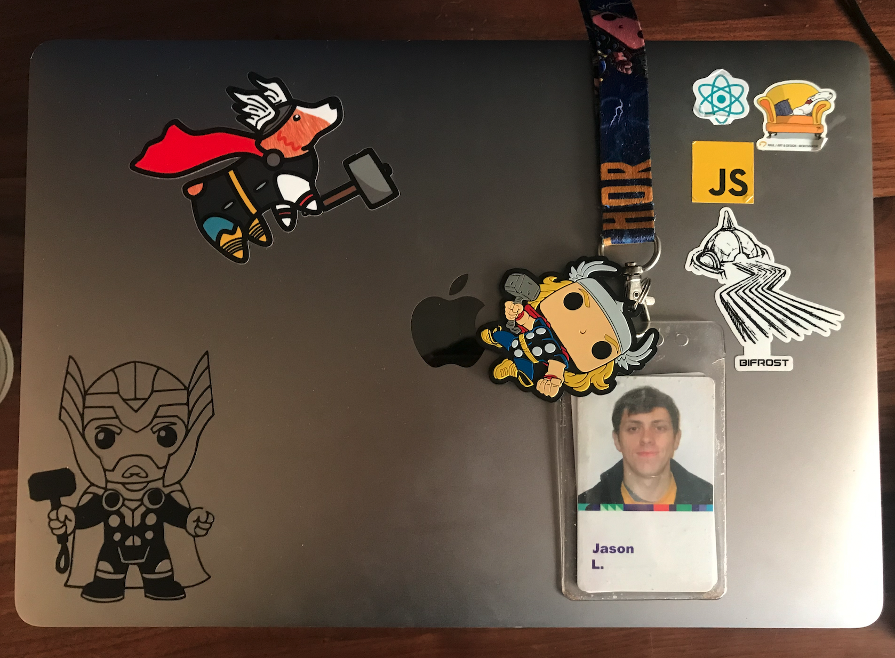

Well the title says it all after 2 years and 8 months I have left Walmart, if you didn’t know I was working in Walmart on one of the Fulfillment Center software teams called Thor (like the superhero), we controlled the software inside the four walls of many of Walmart’s FCs. I started as one of the first people on my team in Dublin Ireland as a Senior Software engineer soon after I was promoted to Tech Lead. 

My team was responsible for the Frontend of the Warehouse management system (WMS). During that time we delivered so many features that made our fulfillment centers more efficient while also and making the life easier for our team members / customers in the warehouse doing the hard work. 

My team was amazing, I have never been apart of such an effective and friendly team, everybody on the team was a Rockstar (as much as I hate this word) so why I am leaving?

Well early this year Walmart made a decision to close the Dublin office which meant that our entire office was being made redundant. Initially this did come as a shock but as I am writing this I can see it was purely a business decision. I really don’t have any harsh feeling towards Walmart. They gave us plenty of notice, time and support to find a role internally (in the USA) or externally. 

I would like to thank Walmart for helping me grow my career and become a better Software professional. I have taken a role external to Walmart and I am excited to get started, I will post about the next chapter in my life soon.

Until then

Jason

