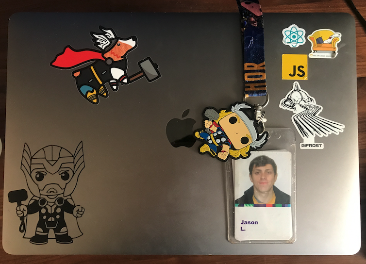

It has almost 2 years since my last post, I mistakenly took two year break to writing blog posts mainly because I got majority brunt out with the pandemic, lockdowns and being made redundant at my position at Walmart then finally starting a new job during the pandemic at Workday.

Living: Currently / Still in Dublin, Ireland

Job: I am now working at Workday as a UI architect on the Learning team working on Workday Learning Management (LMS) product using Javascript, React and GraphQL. I have been loving working on such a complex and large product and I am excited for the future of the product.

My proudest achievements over my last 2 years at workday

- Awarded Dublin Culture champion for Q2 after 2 months at Workday
- Reduced Bundle size by 42% thereby making visits to Learning faster and reducing the time it takes for users to be able to interact with the page resulting in a better user experience
- Improved CI pipeline speed by 49% by speeding up the build, removing duplicate tests and making tests more efficient thereby leading to quicker code reviews and delivery.
- Upskilled and mentored 3 Backend teams on Frontend allowing them to deliver UI customer features ahead of schedule.
- Brought stability of CI pipeline from <60% to 90% thereby reducing time spent rerunning tests, leading to quicker feature development

I am not going to promise to write any more post and honestly this was always more of a personal journal for me.

Jason
