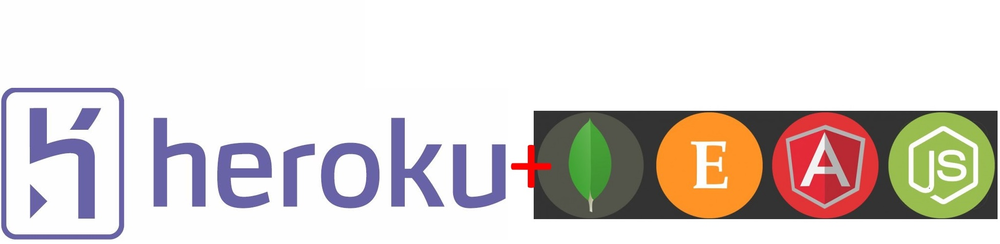
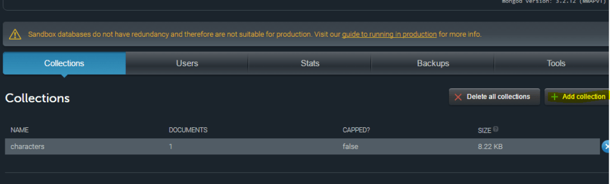
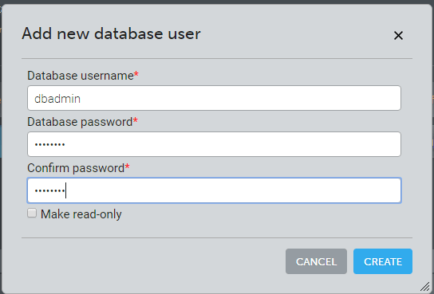
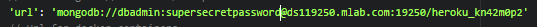
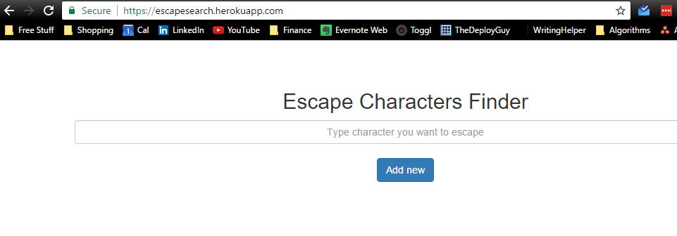

Last week we discussed [Deploying a NodeJS application to Heroku in 5 minutes](http://wp.me/p7DVqH-8T), the one problem with this tutorial was if your application had a database it wouldn't work. This week I will show you how to Deploy a MEAN stack application that connects out to a hosted Mongo Database. I will not be going into to exactly what each of the commands is doing as I did last week.

## Project

We will be deploying the "Programming Escape Character Finder" that we build in [this tutorial series. ](http://wp.me/p7DVqH-65) It is an extremely simple MEAN stack application that displays escape characters for different programming languages. In our initial project, we were just connecting to a local DB sitting on your own machine, since this won't work on Heroku, we are going to connect to an external MongoDB provider. The one that I will be using is completely free for a small barebones Database.

#### Steps:

1. Sign up for free account at [https://mlab.com/](https://mlab.com/) and sign in: \*Note: This can be done in Heroku but they will want you to enter your credit card details but I wanted to avoid that\*
2. Set up a new database by clicking the add collection button and give it a name. 
3. Set up a new user account to access the database, Click the "Users" tab and click add database user:  Pick a username and password ( you will need this later)
4. Now that we have the DB setup, inside the project edit config/database.js and change the mongodb:// url to match what is in the web portal e.g:  Database.js should look like this:  Note: If you plan to use this in production and you don't want to have your password in the source then take a look at Heroku's environment variables.
5. Run the project locally to make sure it connects up correctly (npm start). This will help avoid trouble later.

Once we have verified that we are connecting into the remote DB provider lets setup a new Heroku project:

1. Go to the Directory: `cd [your-project-directory]`
2. Create an Heroku app by running:`heroku create` **Note: This will give your application a random unique name**. If you want a custom name run the following: `heroku create --app your_unique_app_name`
3. Deploy the code by pushing a master branch: `git push heroku master`
4. Verify its now running on Heroku via: `heroku open`

Woo, it's working, if it didn't work run: `heroku logs` and see what the issue is. If you verified it could connect up to the remote database before setting up the Heroku project it should run perfectly.  It is extremely easy to deploy a MEAN stack application to Heroku and have it running in a few minutes. This is great for demo projects or to show clients a working example of the project. I hope you guys enjoy this tutorial if you have questions let me know!

Until next time,

Jason
