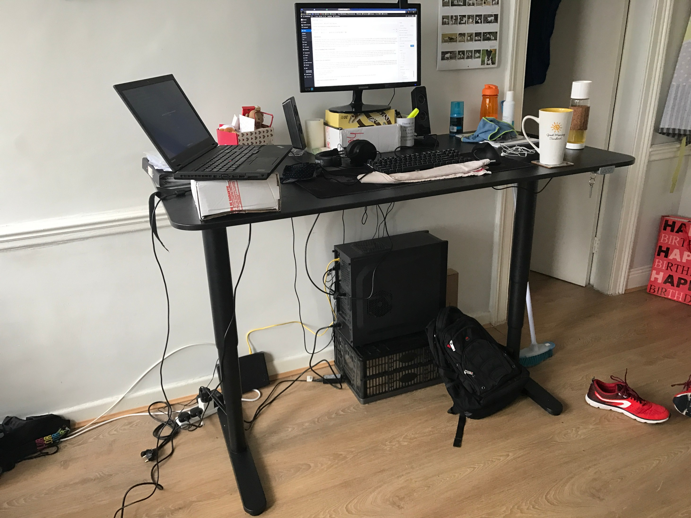

**Introduction**

Welcome back, This week I taught I would take a break from discussing frameworks/tools and bring up the subject of developer health, more specifically Standing Desks. The reason why I bought a standing desk was that I recently read the book [Get Up!: Why Your Chair Is Killing You and What You Can Do about It, By James A. Levine](https://www.amazon.co.uk/gp/product/B00V1E6YO0/ref=as_li_tl?ie=UTF8&camp=1634&creative=6738&creativeASIN=B00V1E6YO0&linkCode=as2&tag=thedeployguy-21) and it got me thinking about how much we really sit nowadays. Levine says "Sitting is more dangerous to your health than smoking" and "for every hour we spend sitting in our chairs, we lose two hours of our lives". While that statement might seem a bit extreme, he goes on to explain why this is the case and just how sitting impacts your body. I highly recommend this book to anybody that sits for long periods of their day as it will change your mindset. Enough of me giving you a lecture so let's get on with the review.

**Why are Standing Desks recommended**

When I started reading about Standing desks I taught how can you stand for the entire day?. Well, that is not the point, the point is to keep your body aligned in a better position than it would otherwise when sitting. When you are sitting it's very easy to slouch and not realise your doing it, or shift your shoulders forward slightly and have your body get used to that but when your standing it becomes a lot harder. Don't get me wrong you can still stand the wrong way but for me, since my body is not used to standing still it tends to complain more when it's not in the right position. Using a standing desk will give you back some of the minutes sitting has taken, it will also improve your posture and encourage you to move your body.

**BEKANT Ikea Sit/Stand Desk**

After looking around online I found there isn't actually much choice out there for <700 euro. A lot of people recommended looking at [https://www.autonomous.ai/](https://www.autonomous.ai/) desks, they seem to have good reviews and their prices are very good when compared to the desks of [Up Desks](https://www.myupdesk.com/). After trying to buy the desk I found it was going to cost well over 700 euro to be delivered to Ireland and it would take weeks. After losing hope of ever having a Standing Desk I found that IKEA had one, after reading reviews and seeing the desk in the IKEA store I decided on the version to buy which was the "[BEKANT Sit/Stand Desk in Black](http://www.ikea.com/ie/en/products/desks/office-desks/bekant-desk-sit-stand-black-brown-black-spr-29061192/)". There are a couple of variations of standing Desks IKEA offer:

- Motorized Smaller [cheaper version](http://www.ikea.com/ie/en/products/desks/office-desks/bekant-desk-sit-stand-oak-veneer-white-spr-09061188/)
- [Hand Adjusted standing desk](http://www.ikea.com/us/en/catalog/products/S49084965/)
- [Full sized version](http://www.ikea.com/ie/en/products/desks/office-desks/bekant-desk-sit-stand-black-brown-black-spr-29061192/)

You will be able to customise the table colour and legs of the desk through IKEA in case you don't like mine.(My setup is in the cover picture)

**What I liked and disliked about the Desk**

Liked:

- Assembly was easy
- Very sturdy
- Height adjustment is quick and easy to use
- Height adjustment can be disabled by removing the key (useful if you have children that like to press buttons)
- Has cable management built in under the desk
- When you get tired of standing it's easily put into sitting mode.
- Can position height adjustment buttons on any corner of the table.

Disliked:

- No memory settings for the height. A lot of the more expensive standing desks will have this feature but it's not required as there is an easy way to set the height of your desk shown [here](https://www.youtube.com/watch?v=21CkhI5Bfvo)
- While assembly was easy, parts of the desk are extremely heavy and take two people to lift so get somebody to help you.

**Conclusion**

I love my standing desk, it's giving me more energy and making me more motivated to do productive stuff when I am standing(Yes I am writing this while standing). I have only been using it for a few weeks at the time of posting this but I can already feel the difference in my body when compared to sitting. If you spend any significant amount of time sitting at a desk then I highly recommend picking one up, I promise you won't regret it.

Until next time,

Jason
